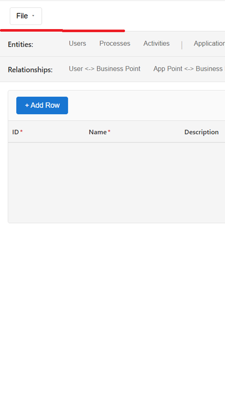

# Spec: Frontend Chat Panel (Meta-Model View)

## Overview

Introduce a collapsible, resizable left-hand Chat Assistant panel in the Meta-Model view, wired to the Gateway chat endpoint (POST /api/chat), with session persistence and basic chat UX (user vs assistant bubbles with distinct styling).

## Problem Statement

### Current State
- Meta-Model view shows entity/relationship grids with tab navigation
- No chat capability exists in the frontend
- Users cannot interact with the chat assistant to generate OpenAPI specs

### Desired State
- A collapsible chat panel appears on the left side of the Meta-Model view
- Users can send messages and receive assistant responses
- Session is maintained across messages within the same page session
- Clear visual distinction between user and assistant messages

## Scope

**In Scope:**
- Frontend only (React + TypeScript)
- Chat panel in Meta-Model view only
- Basic chat UX with message bubbles
- Gateway integration (POST /api/chat)

**Out of Scope:**
- Backend changes
- Diagram view changes
- Streaming responses (SSE)
- Rich markdown rendering
- Authentication/authorization

## Requirements

### Functional Requirements

#### 1. Panel Placement and Layout

**Position Reference:**



The chat panel's TOP edge must align with the red line shown in the screenshot - i.e., below the TopBar (File menu / top navigation bar) at 60px from the top of the viewport. The panel must not overlap the TopBar header.

**Layout Integration:**

```
┌────────────────────────────────────────────────────────────┐
│                        TopBar (60px)                       │
├──────────┬─────────────────────────────────────────────────┤
│          │                                                 │
│   Chat   │              Meta-Model Content                 │
│  Panel   │         (Entities/Relationships tabs           │
│  (left)  │                + Grid)                          │
│          │                                                 │
│  320px   │              remaining width                    │
│  default │                                                 │
│          │                                                 │
└──────────┴─────────────────────────────────────────────────┘
```

**Panel Behavior:**

| Property | Specification |
|----------|---------------|
| Default state | Collapsed |
| Default width | 320px |
| Min width | 240px |
| Max width | 50% of viewport width |
| Position | Left side of Meta-Model view |
| Collapsible | Yes - toggle button on panel edge |
| Resizable | Yes - draggable vertical resize handle on right edge |

**Collapsed State:**
- Render a slim vertical tab (32px width) with a chat icon and "Chat" label
- Clicking the tab opens the panel to its previous width
- Tab should have visual affordance indicating it's clickable

**Expanded State:**
- Full panel with header, message list, and input area
- Collapse button in header or on right edge
- Resize handle on right edge (cursor: col-resize)

#### 2. Chat Panel Structure

**Component Hierarchy:**

```
ChatPanel (flex column)
├─ ChatHeader (fixed height)
│   ├─ Title: "Chat Assistant"
│   └─ Collapse button
├─ ChatMessageList (flex: 1, overflow-y: auto)
│   └─ ChatBubble[] (mapped messages)
└─ ChatInput (fixed at bottom)
    ├─ Textarea (multiline, resizable)
    └─ Send button
```

**ChatHeader:**
- Height: 48px
- Title: "Chat Assistant" (left-aligned)
- Collapse button (right-aligned, icon button)
- Bottom border separator

**ChatMessageList:**
- Flex-grow: 1 (takes remaining vertical space)
- Overflow-y: auto (scrollable)
- Padding: 12px
- Auto-scroll to bottom when new message added (unless user has manually scrolled up)

**ChatInput:**
- Fixed at bottom of panel
- Border-top separator
- Padding: 12px

#### 3. Chat Bubble Styling

**User Message Bubbles:**

| Property | Value |
|----------|-------|
| Alignment | Right-aligned |
| Background | #E6F4EA (light green) |
| Text color | #1a1a1a (near-black) |
| Border radius | 12px (with 4px on bottom-right) |
| Max width | 80% of message list width |
| Padding | 10px 14px |
| Margin | 4px 0 |
| Font size | 14px |

**Assistant Message Bubbles:**

| Property | Value |
|----------|-------|
| Alignment | Left-aligned |
| Background | #F1F1F1 (light grey) |
| Text color | #1a1a1a (near-black) |
| Border radius | 12px (with 4px on bottom-left) |
| Max width | 80% of message list width |
| Padding | 10px 14px |
| Margin | 4px 0 |
| Font size | 14px |

**Message Layout:**

```css
/* User message - right aligned */
.userMessage {
  align-self: flex-end;
  background: #E6F4EA;
  border-radius: 12px 12px 4px 12px;
}

/* Assistant message - left aligned */
.assistantMessage {
  align-self: flex-start;
  background: #F1F1F1;
  border-radius: 12px 12px 12px 4px;
}
```

#### 4. Chat Input Area

**Textarea:**

| Property | Value |
|----------|-------|
| Default rows | 3 |
| Min height | 60px |
| Max height | 150px |
| Resize | vertical (user can drag to resize) |
| Overflow | auto (scrolls internally when content exceeds height) |
| Placeholder | "Type a message..." |
| Border | 1px solid #ddd |
| Border radius | 8px |
| Padding | 10px |

**Send Button:**

| Property | Value |
|----------|-------|
| Position | Below textarea, right-aligned |
| Width | auto (content-based) |
| Padding | 8px 16px |
| Background | #1976D2 (primary blue) |
| Text color | white |
| Border radius | 6px |
| Disabled state | When textarea is empty/whitespace-only |
| Disabled style | opacity: 0.5, cursor: not-allowed |

#### 5. Gateway Integration

**API Endpoint:**

```
POST /api/chat
Content-Type: application/json
```

**Request Payload:**

```typescript
interface ChatRequest {
  sessionId?: string;  // Optional on first request
  message: string;
}
```

**Response Payload:**

```typescript
interface ChatResponse {
  sessionId: string;
  assistant: {
    message: string;
    artifacts?: {
      savedSpec?: {
        interfaceId: string;
        interfaceName: string;
        architectureFilename: string;
        format: string;
        savedPath: string;
        specLink: string;
      };
    };
  };
}
```

**Chat Flow:**

1. User types message and clicks Send
2. Immediately:
   - Append USER bubble (right-aligned, green)
   - Clear textarea
   - Disable Send button
   - Show loading indicator (optional: "typing..." placeholder)
3. Call POST /api/chat with message and sessionId (if exists)
4. On response:
   - Store sessionId if not already stored
   - Append ASSISTANT bubble (left-aligned, grey)
   - Re-enable Send button
   - Auto-scroll to bottom
5. On error:
   - Append ERROR bubble or show inline error message
   - Re-enable Send button

#### 6. Session Management

**Session Storage:**
- Store `sessionId` in component state (ChatPanel or ChatContext)
- First response from Gateway provides sessionId
- Include sessionId in all subsequent requests

**Session Lifetime:**
- Page reload resets session (no persistence required for v1)
- Session scoped to Meta-Model view

**State Structure:**

```typescript
interface ChatState {
  sessionId: string | null;
  messages: ChatMessage[];
  isLoading: boolean;
}

interface ChatMessage {
  id: string;           // UUID for React key
  role: 'user' | 'assistant';
  content: string;
  timestamp: Date;
}
```

### Non-Functional Requirements

1. **Performance:** Panel resize should be smooth (use CSS transitions or requestAnimationFrame)
2. **Accessibility:** Proper ARIA labels on buttons, textarea should be focusable
3. **Responsive:** Panel should not break on smaller screens (min-width enforced)

## Technical Design

### Component Structure

```
frontend/src/components/chat/
├── ChatPanel.tsx           # Main panel with collapse/resize
├── ChatPanel.module.css    # Panel styles
├── ChatMessageList.tsx     # Scrollable message container
├── ChatBubble.tsx          # Individual message bubble
├── ChatBubble.module.css   # Bubble styles
├── ChatInput.tsx           # Textarea + Send button
├── ChatInput.module.css    # Input styles
└── index.ts                # Exports

frontend/src/api/
└── chatApi.ts              # Gateway API client

frontend/src/hooks/
└── useChatSession.ts       # Optional: session state hook
```

### Files to Create

| File | Description |
|------|-------------|
| `frontend/src/components/chat/ChatPanel.tsx` | Main panel component with collapse/resize |
| `frontend/src/components/chat/ChatPanel.module.css` | Panel styles |
| `frontend/src/components/chat/ChatMessageList.tsx` | Scrollable message list |
| `frontend/src/components/chat/ChatBubble.tsx` | Message bubble component |
| `frontend/src/components/chat/ChatBubble.module.css` | Bubble styles |
| `frontend/src/components/chat/ChatInput.tsx` | Input area component |
| `frontend/src/components/chat/ChatInput.module.css` | Input styles |
| `frontend/src/components/chat/index.ts` | Component exports |
| `frontend/src/api/chatApi.ts` | Gateway API client |

### Files to Modify

| File | Changes |
|------|---------|
| `frontend/src/components/MetaModelView/MetaModelView.tsx` | Add ChatPanel to layout |
| `frontend/src/components/MetaModelView/MetaModelView.module.css` | Adjust layout for side panel |

### Layout Integration

**Current MetaModelView Structure:**
```tsx
<div className={styles.container}>
  <div className={styles.headerRow}>...</div>  {/* Entities tabs */}
  <div className={styles.headerRow}>...</div>  {/* Relationships tabs */}
  <div className={styles.gridContainer}>...</div>
</div>
```

**Updated MetaModelView Structure:**
```tsx
<div className={styles.container}>
  <ChatPanel />  {/* New: left panel */}
  <div className={styles.mainContent}>
    <div className={styles.headerRow}>...</div>
    <div className={styles.headerRow}>...</div>
    <div className={styles.gridContainer}>...</div>
  </div>
</div>
```

**Updated CSS:**
```css
.container {
  display: flex;
  flex-direction: row;  /* Changed from column */
  height: 100%;
  overflow: hidden;
}

.mainContent {
  display: flex;
  flex-direction: column;
  flex: 1;
  overflow: hidden;
}
```

### API Client

**chatApi.ts:**

```typescript
const GATEWAY_BASE = import.meta.env.VITE_GATEWAY_BASE_URL ?? '';

export interface ChatRequest {
  sessionId?: string;
  message: string;
}

export interface ChatResponse {
  sessionId: string;
  assistant: {
    message: string;
    artifacts?: object;
  };
}

export async function postChatMessage(request: ChatRequest): Promise<ChatResponse> {
  const res = await fetch(`${GATEWAY_BASE}/api/chat`, {
    method: 'POST',
    headers: { 'Content-Type': 'application/json' },
    body: JSON.stringify(request),
  });

  if (!res.ok) {
    throw new Error(`Chat request failed: ${res.status}`);
  }

  return res.json();
}
```

## Out of Scope

- Streaming responses (SSE) - can be added later
- Rich markdown rendering, code blocks, syntax highlighting
- Chat availability outside Meta-Model view
- Authentication/authorization changes
- Persisting chat history across page reloads
- Context injection (filename, interfaceId) - can be added later

## Acceptance Criteria

1. **Panel Placement:**
   - Chat panel appears only in Meta-Model view
   - Panel starts at vertical position below TopBar (60px from top)
   - Panel is on the left side

2. **Panel Behavior:**
   - Panel defaults to collapsed state
   - Collapsed tab shows chat icon and "Chat" label
   - Clicking collapsed tab opens panel to 320px width
   - Panel is resizable via drag handle (240px to 50% viewport)
   - Collapse button closes panel back to tab

3. **Message Display:**
   - User messages are right-aligned with light green (#E6F4EA) background
   - Assistant messages are left-aligned with light grey (#F1F1F1) background
   - Message list scrolls independently of input area
   - Auto-scroll to newest message on new message

4. **Input Area:**
   - Textarea is multiline (3 rows default)
   - Textarea is vertically resizable
   - Send button disabled when textarea is empty/whitespace
   - Clicking Send adds user bubble and calls API

5. **API Integration:**
   - POST /api/chat is called on Send
   - sessionId from first response is stored and reused
   - Assistant response is displayed as assistant bubble
   - Errors are handled gracefully

## Verification Steps

### Unit Tests

1. **ChatBubble.test.tsx:**
   - Test user bubble has correct styling
   - Test assistant bubble has correct styling
   - Test content is rendered correctly

2. **ChatInput.test.tsx:**
   - Test Send button disabled when empty
   - Test Send button enabled with content
   - Test onSend callback triggered on button click
   - Test textarea clears after send

3. **ChatPanel.test.tsx:**
   - Test panel renders collapsed by default
   - Test clicking tab expands panel
   - Test clicking collapse button collapses panel
   - Test resize handle changes width

4. **chatApi.test.ts:**
   - Test postChatMessage sends correct request
   - Test response is parsed correctly
   - Test error handling

### Manual Verification

1. Open application and navigate to Meta-Model view
2. Verify collapsed chat tab is visible on left
3. Click tab to expand panel
4. Type a message and click Send
5. Verify user message appears (green, right-aligned)
6. Verify assistant response appears (grey, left-aligned)
7. Send another message and verify sessionId is reused
8. Resize panel and verify constraints work
9. Collapse panel and verify tab appears
10. Switch to Diagrams view and verify chat panel is not visible
11. Switch back to Meta-Model and verify chat state is preserved

## Risks and Mitigations

| Risk | Likelihood | Impact | Mitigation |
|------|------------|--------|------------|
| Gateway unavailable | Medium | High | Show error message, allow retry |
| Large messages cause layout issues | Low | Medium | Max-width constraints on bubbles |
| Resize causes performance issues | Low | Low | Use CSS transitions, debounce |
| Session lost on navigation | Medium | Low | Document as expected behavior for v1 |
