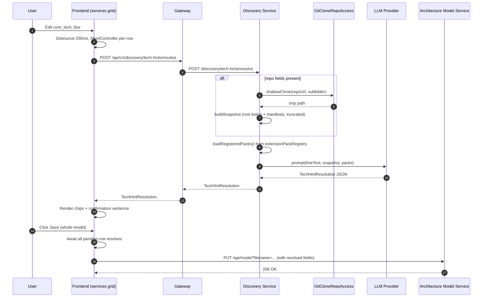

# Specification: Tech Hints LLM Resolution

## Summary

The current discovery pipeline derives a language pack + framework pack from the free-text `core_tech` field on each service by running `parseCoretech`, a heuristic comma-split that fails on common real-world strings like `"Java 21 (Spring Boot 3)"` and silently drops the service into tier C (LLM-only) mode. Users have no visibility into this silent degradation until a run produces unexpectedly shallow output. This spec introduces save-time, LLM-assisted resolution of `core_tech` against the closed set of 9 language packs and 17 framework packs registered in `extensionPackRegistry`, with an optional repo snapshot cross-check via `GitCloneRepoAccess`. Results are persisted to five new structured columns on the `services` table (`core_tech_resolved`, `core_tech_language_pack`, `core_tech_framework_packs`, `core_tech_resolution_confidence`, `core_tech_resolved_at`). The services grid gets a new custom cell modelled on `PackageSetCell.tsx` that shows chips + a confirmation sentence inline, blocks Save on `repoCrossCheck.status === 'conflict'`, and holds the whole-model PUT until every dirty row's resolve promise has settled. The discovery-run tier gate stops calling `parseCoretech` and reads the new columns directly, making tier A/B/C selection fully deterministic.

## Goal

Replace the fragile run-time `parseCoretech` heuristic with a deterministic, save-time LLM resolution stored in structured columns, giving service editors an immediate, correctable preview of how their service will be analysed and eliminating silent tier-C fallbacks.

## User Stories

- As a **service editor creating a new service with clear tech** (e.g. "Python 3.12, FastAPI"), I want the grid to auto-detect `python-3` + `fastapi` packs on blur so that I can confirm the interpretation with one glance and move on without touching discovery config.
- As a **service editor creating a new service with vague or misspelled tech** (e.g. "Java 21 (Spring Boot 3)" or "java w/ springboot"), I want the LLM to normalise it to the correct registered packs and show me the confirmation sentence, so that the discovery run does not silently fall back to tier C because of a parse failure.
- As a **service editor re-editing an existing service after adding a `repo_location`**, I want the row to re-resolve with the repo snapshot on my next edit or Save, so that my prior tech-only resolution is upgraded to a repo-verified resolution and any mismatch between stated tech and actual repo contents is surfaced before I run discovery.

## Architecture Overview

End-to-end call chain for the save-time resolve:



## Specific Requirements

**Column reorder in services grid**
- Re-order columns so `repo_location` and `repo_subfolder` render before `core_tech` in the services grid config.
- Order near tech columns becomes: `... name, description, service_type, repo_location, repo_subfolder, core_tech, ...`.
- Edit path is unchanged: existing `GridCell` registration swaps in the new custom cell for the `core_tech` column only.
- No other entry points change — grid row is the single surface (requirement Q5).
- Existing tab order remains left-to-right so blur sequence matches the reorder.

**New custom tech-hints cell (frontend)**
- Modelled on `frontend/src/components/Grid/PackageSetCell.tsx` — reuse the inline-preview container pattern and module CSS naming conventions.
- On blur of the editable text input: debounce 250ms, then fire `gatewayClient.resolveTechHints(...)`; cancel any in-flight resolve for the same row via `AbortController`.
- Pending state: lightweight inline spinner inside the cell.
- On success: render the `language` + each `framework` as removable chips (`x` affordance) plus the `confirmationSentence` on a second line.
- Chip removal toggles the row into `manual-override` confidence (see confidence enum below), suppresses re-resolve until the raw text changes.
- Inline warning area under the cell renders `repoCrossCheck.note` when status is `partial` (amber, non-blocking) or `conflict` (red, blocks Save).
- Stale indicator (greyed chips) appears whenever `core_tech` or `repo_location`/`repo_subfolder` has been edited since `core_tech_resolved_at`.

**Gateway relay route**
- Add `POST /api/v1/discovery/tech-hints/resolve` parallel to `gateway/src/routes/discoveryGapFill.ts`.
- Thin pass-through: forwards `{ freeText, repoLocation?, repoSubfolder? }` to discovery-service and relays the JSON response unchanged.
- Reuses existing LLM provider config via `gateway/src/services/llmClient.ts` — no separate fast-model knob.
- Register route in the gateway router index alongside the other discovery routes.
- Error handling mirrors `discoveryGapFill.ts`: 502 if downstream is unreachable, 504 on downstream timeout, passes through 4xx/5xx bodies otherwise.

**Discovery-service resolve endpoint**
- New route at `discovery-service/src/routes/techHintsResolve.ts` registered on the existing Express app.
- Request body validated: `freeText` required non-empty string; `repoLocation` + `repoSubfolder` optional strings.
- When repo fields present: call `GitCloneRepoAccess.shallowClone(repoUrl, subfolder)` into `os.tmpdir()`; on any failure fall back to tech-only mode rather than erroring.
- Snapshot builder caps (see Snapshot Truncation below) feed directly into the prompt.
- Prompt assembly loads the closed set from `extensionPackRegistry.ts::getRegisteredPacks()`; closed set is injected as a bullet list with pack ID + predicate (`language`, `technology`).
- Returns the `TechHintResolution` JSON verbatim from the LLM after schema validation.
- Cleans up the tmp clone directory on response (success or failure).

**Snapshot truncation caps** *(chosen by spec-writer, may be revised later)*
- Root filename listing: max 30 entries, alphabetical order.
- Per-manifest cap: first 100 lines.
- Max 8 manifest files total if multiple present.
- Total payload cap: ~8 KB; if exceeded, drop manifests in descending size order.
- Recognised manifests: `pom.xml`, `build.gradle`, `build.gradle.kts`, `package.json`, `tsconfig.json`, `requirements.txt`, `pyproject.toml`, `go.mod`, `Cargo.toml`, `Gemfile`, `composer.json`, `*.csproj`, `CMakeLists.txt`.
- Truncation marker (`... [truncated]`) appended when any cap hits, so the LLM is aware.

**LLM prompt structure** *(chosen by spec-writer, may be revised later)*
- System prompt lists the 9 language packs + 17 framework packs as bullets, each as `- <packId> (predicate: language|technology)`.
- Explicit instruction: *"Choose only from the given lists. If nothing matches, return `languagePack: null` and `frameworkPacks: []`."*
- Few-shot: one tech-only example and one repo-enriched example.
- User turn carries `freeText` and the snapshot block (if any) clearly delimited.
- Output schema reiterated at the end of the user turn; response parsed via a Zod/typebox schema guard in the endpoint.

**Resolution result shape (`TechHintResolution`)**
- Exactly the shape from decision #3: `{ language, frameworks, languagePack, frameworkPacks, confirmationSentence, repoCrossCheck, confidence }`.
- `confidence` enum locked to `'high' | 'low' | 'none' | 'tech-only' | 'manual-override'` — spec-writer adds `manual-override` explicitly to record chip-removal state server-side (distinct from the LLM-emitted values).
- `repoCrossCheck` is `null` when no repo was supplied.
- `languagePack` must be `null` or a string that exists in the registered pack set; `frameworkPacks` same constraint per element.
- Endpoint rejects malformed LLM responses (missing required keys, invalid pack names) and maps to the generic failure path.

**Data model changes (architecture-model-service)**
- New Liquibase changeset adding 5 columns to `services`:
  ```sql
  ALTER TABLE services
    ADD COLUMN core_tech_resolved JSONB NULL,
    ADD COLUMN core_tech_language_pack VARCHAR(100) NULL,
    ADD COLUMN core_tech_framework_packs TEXT[] NULL,
    ADD COLUMN core_tech_resolution_confidence VARCHAR(20) NULL
      CHECK (core_tech_resolution_confidence IN ('high','low','none','tech-only','manual-override')),
    ADD COLUMN core_tech_resolved_at TIMESTAMPTZ NULL;
  ```
- `ServiceEntity.java` adds matching fields: `Map<String,Object> coreTechResolved` (jsonb via Hypersistence or equivalent), `String coreTechLanguagePack`, `List<String> coreTechFrameworkPacks`, `String coreTechResolutionConfidence`, `Instant coreTechResolvedAt`.
- `ServiceDto.java` mirrors those five fields with matching JSON property names in camelCase.
- `EntityMapper.java` updated to map both directions and pass the raw jsonb through unchanged.
- `core_tech` column untouched; existing rows default all new columns to NULL, no migration.

**Frontend save gating**
- Pending-resolutions slice (separate from grid state) keyed by service row ID; each entry holds `{ promise, abort, startedAt }`.
- Save click reads the slice; if non-empty, Save button shows `"Resolving N rows..."` text and awaits `Promise.allSettled(pending)` before firing the PUT.
- Any row whose resolve rejects falls through to Q12 behaviour (raw saved, resolved fields NULL, toast) and does NOT block the overall Save.
- Save is disabled (not just delayed) while any dirty row has `repoCrossCheck.status === 'conflict'`; inline block with explanation near the Save control plus red highlight on the offending row(s).
- Stale rows (edited since last resolve) implicitly trigger a resolve on Save if they have no in-flight promise.

**Discovery run tier gate change**
- Discovery run code-path switches from `parseCoretech(coreTech)` to reading `ServiceEntity.coreTechResolved` / `coreTechLanguagePack` / `coreTechFrameworkPacks` directly.
- Behavior matrix:
  - `coreTechResolved IS NULL` → reject run with HTTP 409 + code `TECH_HINTS_UNRESOLVED` + message directing user to open the row and resolve.
  - `coreTechResolved` present, `languagePack IS NULL` AND `frameworkPacks = []` → tier C; the existing `confirmLlmSolo: true` gate applies.
  - `languagePack` non-null → tier A or B per existing V3 logic, read directly from the two denormalised columns (no hint-array reconstruction).
  - Repo absent (`repo_location` NULL or empty) → existing block remains per decision #10.
- `parseCoretech` is NOT removed — `package_set_default_rules` evaluator still consumes raw `core_tech` (out of scope per Q15).

## Visual Design

No visuals provided — `planning/visuals/` is empty.

## Existing Code to Leverage

**`gateway/src/routes/discoveryGapFill.ts`**
- Structural template for the new gateway relay route.
- Defines the gateway → discovery-service forwarding pattern, error translation, and request validation that the new route should mirror.
- Registered in the same router index as the new tech-hints route.
- Reuses `gateway/src/services/llmClient.ts` — same client will back the new relay without modification.

**`discovery-service/src/services/repoAccess.ts` (`GitCloneRepoAccess`)**
- Provides shallow-clone-to-tmp capability already tested in the discovery pipeline.
- The new resolve endpoint invokes `shallowClone(repoUrl, subfolder)` and traverses the returned tmp path.
- Existing cleanup semantics apply; the new endpoint layers its own `finally` to ensure tmp dirs are removed on early errors.

**`discovery-service/src/services/extensionPackRegistry.ts::getRegisteredPacks()`**
- Authoritative source for the closed set of 9 language packs + 17 framework packs.
- The new endpoint imports this directly and formats the output into the system prompt bullet list.
- Pack names returned here are exactly what the LLM must echo back in `languagePack` / `frameworkPacks`.

**`frontend/src/components/Grid/PackageSetCell.tsx` + `PackageSetPreview.tsx`**
- Template for the new `TechHintsCell.tsx`: editable text input + inline preview block + module CSS layout.
- Chip rendering + removable chip affordance already solved in `PackageSetPreview`; copy and adapt.
- Module CSS and flex layout conventions to match grid's other custom cells.

**`discovery-service/src/services/discoveryV3Pipeline.ts` (tier gate caller)**
- Point of change for the tier-gate switch: locate the `parseCoretech(coreTech)` call site(s) inside the V3 pipeline entry and replace with direct reads of the resolved columns.
- `package_set_default_rules` evaluator is a separate caller of `parseCoretech` and MUST be left untouched.

## Open Decisions Recorded *(chosen by spec-writer, may be revised later)*

1. **LLM prompt wording** — bullet-list closed set with pack ID + predicate; explicit "choose only from lists" instruction; two few-shot examples (tech-only, repo-enriched). Rationale: keeps prompt short enough for 10 s budget while forcing closed-set compliance.
2. **Confidence enum** — locked to `'high' | 'low' | 'none' | 'tech-only' | 'manual-override'`. No `'medium'`. Rationale: keeps frontend badge logic a simple 5-branch switch.
3. **Re-resolve on `repo_location` blur** — mark stale only, do NOT fire on repo-field blur. Re-resolve fires on next `core_tech` blur or Save. Rationale: avoids surprise LLM calls while the user is only editing the repo pointer; Save-time gate covers worst case.
4. **Badge visual treatment** — small amber warning icon in the row's first cell (row indicator column) with hover tooltip *"Tech hints not resolved — edit core_tech to retry."* No row background change. Rationale: keeps the grid scannable; single unambiguous indicator.
5. **Debounce + cancellation** — 250 ms blur-to-resolve debounce; `AbortController` cancels in-flight when user re-edits; at most one resolve per row at a time. Rationale: mirrors the editor's existing typeahead debounce pattern.
6. **Snapshot truncation caps** — 30 filenames, 100 lines/manifest, 8 manifests max, ~8 KB total cap. Rationale: sized to fit within the 10 s latency budget alongside the shallow clone.
7. **In-flight resolve state location** — new Zustand slice keyed by service row ID, separate from grid state. Rationale: Save-click needs to observe pending resolves without coupling to grid internals.
8. **Error taxonomy** — single user-facing failure path (toast + save-with-null-resolved). Internally, structured log lines carry `reason: 'clone_timeout' | 'llm_timeout' | 'llm_malformed' | 'network_error'` for telemetry. Rationale: keeps UX simple, preserves observability.
9. **Save waits for all in-flight row resolves** — YES, whole-model PUT is held until every pending resolve settles; Save button shows `"Resolving N rows..."`; individual row failures fall through to toast path but don't block Save. Rationale: whole-model PUT semantics leave no choice but to block on all.

## Data Model (concrete)

Liquibase changeset (to be added under `architecture-model-service/src/main/resources/db/changelog/sql/`):

```sql
--liquibase formatted sql
--changeset gjohnston:2026-04-20-tech-hints-resolved
ALTER TABLE services
  ADD COLUMN core_tech_resolved JSONB NULL,
  ADD COLUMN core_tech_language_pack VARCHAR(100) NULL,
  ADD COLUMN core_tech_framework_packs TEXT[] NULL,
  ADD COLUMN core_tech_resolution_confidence VARCHAR(20) NULL
    CHECK (core_tech_resolution_confidence IN ('high','low','none','tech-only','manual-override')),
  ADD COLUMN core_tech_resolved_at TIMESTAMPTZ NULL;
--rollback ALTER TABLE services
--rollback   DROP COLUMN core_tech_resolved,
--rollback   DROP COLUMN core_tech_language_pack,
--rollback   DROP COLUMN core_tech_framework_packs,
--rollback   DROP COLUMN core_tech_resolution_confidence,
--rollback   DROP COLUMN core_tech_resolved_at;
```

Changeset registered in `db.changelog-master.yaml` after the existing service-related changesets.

`ServiceEntity.java` additions:

```java
@Type(JsonBinaryType.class)
@Column(name = "core_tech_resolved", columnDefinition = "jsonb")
private Map<String, Object> coreTechResolved;

@Column(name = "core_tech_language_pack", length = 100)
private String coreTechLanguagePack;

@Type(ListArrayType.class)
@Column(name = "core_tech_framework_packs", columnDefinition = "text[]")
private List<String> coreTechFrameworkPacks;

@Column(name = "core_tech_resolution_confidence", length = 20)
private String coreTechResolutionConfidence;

@Column(name = "core_tech_resolved_at")
private Instant coreTechResolvedAt;
```

`ServiceDto.java` mirrors these five fields with matching camelCase JSON property names. `EntityMapper.java` adds entries in both `toDto` and `toEntity` directions, passing the jsonb map through unchanged.

## API Contracts

**Gateway relay: `POST /api/v1/discovery/tech-hints/resolve`**

Request:
```json
{
  "freeText": "Java 21 (Spring Boot 3)",
  "repoLocation": "https://github.com/acme/orders-service.git",
  "repoSubfolder": "services/orders"
}
```

Response: 200 with `TechHintResolution` JSON passed through from discovery-service.

Error status codes: 400 validation, 502 downstream unreachable, 504 downstream timeout, 500 generic. Error body:
```json
{ "error": "message", "reason": "clone_timeout|llm_timeout|llm_malformed|network_error" }
```

**Discovery-service: `POST /discovery/tech-hints/resolve`**

Request: same body as gateway relay.

Response 200:
```json
{
  "language": { "name": "Java", "version": "21" },
  "frameworks": [{ "name": "Spring Boot", "version": "3" }],
  "languagePack": "java-21",
  "frameworkPacks": ["spring-boot-3"],
  "confirmationSentence": "Detected Java 21 service using Spring Boot 3, matched against repo's pom.xml.",
  "repoCrossCheck": { "status": "confirmed", "note": "pom.xml confirms Spring Boot 3.2.1" },
  "confidence": "high"
}
```

Error statuses:
- 400 — validation (missing/empty `freeText`).
- 502 — LLM provider upstream error; body includes `reason: 'llm_timeout' | 'llm_malformed' | 'network_error'`.
- 504 — shallow clone exceeded timeout budget; body includes `reason: 'clone_timeout'`.
- 500 — generic fallback.

Clone failure (non-timeout) does NOT produce an error — the endpoint returns 200 with `confidence: 'tech-only'` and `repoCrossCheck: { status: 'partial', note: '<reason>' }`.

**Architecture-model-service: `PUT /api/model?filename=...`** — unchanged route; payload's service objects now carry the five new fields. Backend persists them as-is; no backend-side pending-state logic.

## UX Specification

- **Field order:** `repo_location` → `repo_subfolder` → `core_tech` (left to right). Tab order follows.
- **Inline preview area:** Rendered directly below the `core_tech` input cell in an expanded row region. Contains:
  - Chips row: one chip per resolved pack (language chip styled distinct from framework chips), each with an `x` remove button.
  - Confirmation sentence (single line, italic, muted).
  - Optional warning strip (amber for `partial`, red for `conflict`) carrying `repoCrossCheck.note`.
- **Chip removal:** clicking `x` removes the pack from `frameworkPacks` (or nulls `languagePack` if the language chip is removed); sets confidence to `manual-override`; suppresses re-resolve on next blur unless raw `core_tech` changes.
- **Conflict block:** when any dirty row has `repoCrossCheck.status === 'conflict'`, Save button is disabled with tooltip *"Resolve conflicts before saving"*; the offending row shows the red warning strip and cannot be collapsed.
- **Pending state during save-wait:** Save button label becomes `"Resolving N rows..."` with a spinner icon while `Promise.allSettled` is awaited; click is a no-op during this state.
- **Unresolved-row badge:** amber warning icon in row indicator column (first cell) when `core_tech_resolved IS NULL` OR `confidence === 'none'`; hover tooltip *"Tech hints not resolved — edit core_tech to retry."*
- **Stale indicator:** if `core_tech` or `repo_location`/`repo_subfolder` was edited since `core_tech_resolved_at`, chips render greyed until re-resolved.

## Discovery Run Tier Gate

Call-site change lives in the V3 pipeline tier selection (identified via `discoveryV3Pipeline.ts` tracing the `parseCoretech` import). Behavior matrix:

| State | Behavior |
|---|---|
| `coreTechResolved IS NULL` | **Reject** run — HTTP 409, code `TECH_HINTS_UNRESOLVED`, message *"Resolve tech hints before starting discovery."* |
| `coreTechResolved` present, `languagePack IS NULL`, `frameworkPacks = []` | Tier C. Existing `confirmLlmSolo: true` gate must be passed. |
| `coreTechResolved` present, `languagePack` non-null | Tier A or B per existing V3 logic. Read `languagePack` + `frameworkPacks` directly from the denormalised columns — no hint-array reconstruction. |
| `repo_location` absent | Existing block remains regardless of resolved state (decision #10). |

`parseCoretech` is NOT deleted — `package_set_default_rules` evaluator is a separate caller and stays untouched.

## Affected Files

**Frontend (`frontend/`)**
- `frontend/src/config/gridConfigs.ts` — reorder service columns.
- `frontend/src/components/Grid/GridCell.tsx` — register new cell for `core_tech` column.
- `frontend/src/components/Grid/TechHintsCell.tsx` (new) — custom cell modelled on `PackageSetCell.tsx`.
- `frontend/src/components/Grid/TechHintsCell.module.css` (new).
- `frontend/src/services/gatewayClient.ts` — add `resolveTechHints({ freeText, repoLocation, repoSubfolder })`.
- `frontend/src/stores/pendingResolutionsStore.ts` (new) — Zustand slice for in-flight resolves.
- Save-button component (existing Product → Save control) — consume pending slice and conflict state.

**Gateway (`gateway/`)**
- `gateway/src/routes/techHintsResolve.ts` (new) — relay route.
- Gateway router index — register `POST /api/v1/discovery/tech-hints/resolve`.
- `gateway/src/services/llmClient.ts` — reused unchanged.

**Discovery-service (`discovery-service/`)**
- `discovery-service/src/routes/techHintsResolve.ts` (new) — endpoint.
- `discovery-service/src/services/techHintsResolver.ts` (new) — snapshot builder, prompt assembler, LLM call, schema guard.
- `discovery-service/src/services/repoAccess.ts` — reused unchanged.
- `discovery-service/src/services/extensionPackRegistry.ts` — reused unchanged.
- `discovery-service/src/services/discoveryV3Pipeline.ts` — tier-gate switch from `parseCoretech` to resolved-column reads.

**Architecture-model-service (`architecture-model-service/`)**
- `src/main/resources/db/changelog/sql/2026-04-20-tech-hints-resolved.sql` (new).
- `src/main/resources/db/changelog/db.changelog-master.yaml` — register new changeset.
- `src/main/java/com/example/architecturemodel/model/entity/ServiceEntity.java` — 5 new fields.
- `src/main/java/com/example/architecturemodel/model/dto/entity/ServiceDto.java` — 5 new fields.
- `src/main/java/com/example/architecturemodel/mapper/EntityMapper.java` — bidirectional mapping.

## Test Strategy

**Discovery-service unit tests (`discovery-service/src/__tests__/techHintsResolver.test.ts`)**
- Happy path: tech-only input → valid `TechHintResolution` with `confidence: 'tech-only'` and `repoCrossCheck: null`.
- Happy path: tech + repo fields → clone invoked, snapshot built, `repoCrossCheck.status: 'confirmed'`.
- Clone timeout → 504 with `reason: 'clone_timeout'`.
- Clone non-timeout failure → 200 with `confidence: 'tech-only'` + `repoCrossCheck.status: 'partial'`.
- LLM timeout → 502 with `reason: 'llm_timeout'`.
- LLM malformed JSON → 502 with `reason: 'llm_malformed'`.
- LLM returns pack name not in registry → endpoint rejects as malformed.
- Snapshot caps: large repo with >30 files → exactly 30 filenames in prompt; manifest >100 lines → truncated with marker.

**Discovery-service tier-gate tests (`discovery-service/src/__tests__/discoveryV3Pipeline.techHints.test.ts`)**
- `coreTechResolved IS NULL` → rejects with `TECH_HINTS_UNRESOLVED` 409.
- `languagePack` set → tier A/B selected per existing matrix, reading resolved columns directly.
- `languagePack` null + `frameworkPacks` empty → tier C; `confirmLlmSolo: true` required.
- Repo absent → rejects regardless of resolved state.

**Gateway integration test (`gateway/src/__tests__/techHintsResolve.test.ts`)**
- Happy path pass-through.
- Downstream 502 → gateway returns 502 with `reason` preserved.
- Downstream 504 → gateway returns 504.
- Malformed request body → 400.

**Frontend unit tests (`frontend/src/components/Grid/__tests__/TechHintsCell.test.tsx`)**
- Blur fires resolve after 250 ms debounce.
- Rapid re-edit cancels in-flight via `AbortController`.
- Chip removal sets `confidence: 'manual-override'` and suppresses re-resolve on next blur (unchanged raw text).
- `repoCrossCheck.status === 'conflict'` disables Save button.
- `repoCrossCheck.status === 'partial'` renders amber warning but leaves Save enabled.

**Frontend integration test (`frontend/src/__tests__/saveWaitsForResolve.test.tsx`)**
- Save click while resolves in-flight holds PUT until `Promise.allSettled` completes.
- Save label shows `"Resolving N rows..."` during wait.
- Individual row resolve rejection → row saved with NULL resolved fields + toast; Save proceeds.

**Architecture-model-service tests**
- `EntityMapper` round-trips all 5 new fields including null and populated cases.
- `ServiceDto` serialisation preserves jsonb map shape.
- Liquibase changeset applies cleanly on an existing DB (verified via Spring Boot test context).

## Risks

- **LLM classifies to a pack whose version signature doesn't actually match the repo** (e.g., LLM says `spring-boot-3` but repo is Spring Boot 2 or Spring 4). Mitigation: `repoCrossCheck.status === 'conflict'` blocks Save per requirement Q9 (revised); user forced to fix before saving.
- **10-second latency budget not always achievable** on very large repos or slow LLM responses. Documented acceptable degradation: spinner continues, Save waits; if user navigates away (Case A), resolve completes in background. No hard client-side timeout — backend 504 is the only hard cap (clone timeout).
- **Whole-model PUT semantics mean Save holds on the slowest row**. Mitigated by parallel resolves (`Promise.allSettled`) so the total wait is max(row latencies), not sum. If a row's resolve fails, it falls through to the toast path and does not block Save.
- **Closed-set name drift** — if a pack is renamed in `extensionPackRegistry`, historical rows with the old name in `core_tech_language_pack` become orphaned. Explicitly not addressed here; flagged as known debt.
- **LLM prompt cost** — every service save with a tech edit burns one LLM call. Acceptable per requirement Q1 (reuse of gap-fill provider config, no separate cost knob).

## Out of Scope

- Project-level `discovery_config.techHints` field and its heuristic path (accepted tech debt).
- Adding new language or framework packs — closed set stays at 9 + 17.
- Tier logic changes beyond "read resolved columns instead of `parseCoretech`".
- `package_set_default_rules` evaluator changes — continues reading raw `core_tech` via `parseCoretech`.
- One-off migration of existing rows — user will fix manually via re-save.
- Alternative repo fetch strategies — shallow-clone-to-tmp is the only strategy in scope.
- Per-provider or per-call LLM model knob — single global provider config reused unchanged.
- Other service editor surfaces (wizards, bulk import, CSV) — only the services grid row.
- Silent background retry of failed resolutions — user must re-edit to retry.
