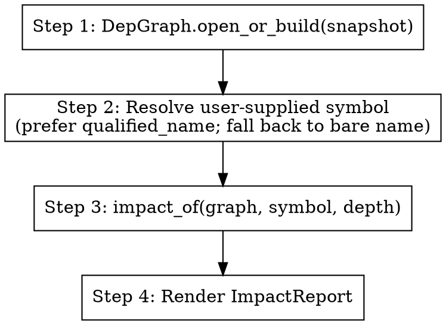

Analyze the blast radius of changing a symbol.



## When to use

When the user asks "what breaks if I change X" or "where is X used", or when
preparing a refactor of a symbol they're worried about.

## How

The agent does NOT walk the call graph itself. It calls the deterministic
`src.dep.impact_of()` engine, then explains the structured result.

Inputs (from the user):
- `symbol` — qualified name (e.g. `OwnerController.list`) or bare name
- optional `--depth N` (default 5)
- optional `--no-endpoints` to skip endpoint reach

Steps:

1. Open the graph: `from src.dep import DepGraph, impact_of` →
   `graph = DepGraph.open_or_build(snapshot_path)`
2. Run impact: `report = impact_of(graph, symbol, depth=N)`
3. If `report.notes` mentions "symbol not found" — try alternatives
   (search same-named symbols, suggest a close match).
4. Otherwise, format `report` as plain English:
   - one-line summary (`report.summary()`)
   - top 5 callers (most-direct first)
   - affected endpoints, grouped by framework
   - subclass methods (only if the symbol is a class)
   - call out high-confidence vs low-confidence callers

## Output shape

```
**Impact of `<qname>`**

Summary: <one-line>.

Direct callers (N):
  - `caller1.qname` — file:line
  - `caller2.qname` — file:line
  ...

Endpoints affected (M):
  - GET /owners (spring-boot)
  ...

Suggested test scope:
  - <tests/specs that reference any direct caller>
```

## Notes for the agent

- Engine is deterministic. Do NOT re-derive callers from grep — trust the report.
- If the symbol resolved to multiple matches, the engine picked the most-referenced
  one and put a note in `report.notes`. Surface that note.
- Sub-2s response when LLM is available; sub-100ms structured-only mode is fine.
