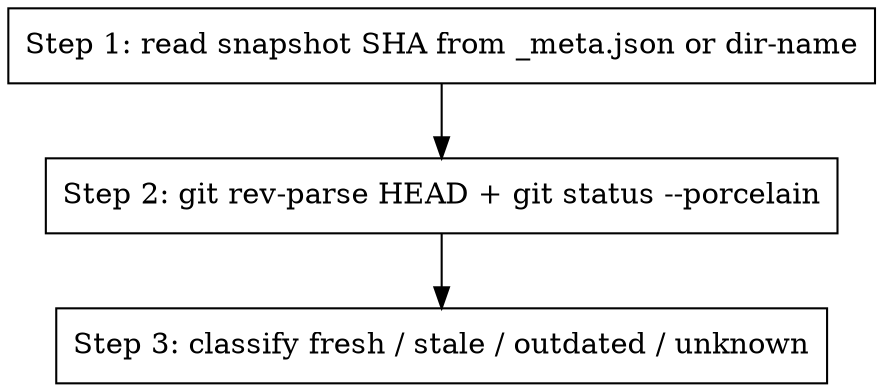

Check if a snapshot is still trustworthy relative to the current working tree.

## When to use

Before any analysis (impact, rename, trace) the user might ask "is this
snapshot up to date?" or you should preflight-check when running queries
that depend on the snapshot reflecting current source.

## How

`from src.refactoring import check_staleness` → `report = check_staleness(snapshot, repo)`.

Levels:
- **fresh** — snapshot SHA == HEAD, working tree clean
- **stale** — snapshot SHA == HEAD, but working tree has uncommitted edits
- **outdated** — snapshot SHA != HEAD (snapshot is from a different commit)
- **unknown** — couldn't find a SHA for the snapshot anywhere

Surface:
- Level + 1-line note
- If `stale`: list `modified_files_since`
- If `outdated` or `unknown`: suggest re-running the AST pipeline

## Without an LLM

Return JSON of the StalenessReport.
