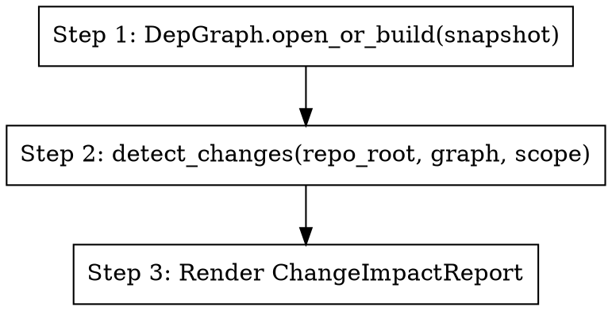

Detect what's at risk in the current `git diff`.



## When to use

The user is about to commit, or just committed, and asks "what could break?"
or "what tests should I run?" or "what's the blast radius of these changes?".

## How

The agent does NOT walk `git diff` itself. It calls the deterministic
`src.refactoring.detect_changes()` engine, then explains the structured result.

Inputs (from the user):
- `--scope` ∈ {`staged` (default), `unstaged`, `all`, `commit:<sha>`}
- `--repo` repo root path (default: `.`)
- `--snapshot` snapshot dir (default: most-recent for the repo)

Steps:

1. Open the graph: `from src.refactoring import detect_changes` and
   `from src.dep import DepGraph` →
   `graph = DepGraph.open_or_build(snapshot_path)`
2. Run detection: `report = detect_changes(repo_root, graph, scope=scope)`
3. If `report.files == []` say "no changes at scope=<scope>" and stop.
4. Otherwise, format `report` as plain English:
   - One-line headline: `risk.level` + `len(impacted_symbols)` symbols across `len(files)` files
   - Per file: status (modified/added/deleted/renamed) + impacted symbols
   - Affected endpoints (always — these are the externally-visible breakages)
   - Top 5 affected callers (qualified names)

## Output shape

```
**Change impact (scope: <scope>)**

Risk: <level> (score <score>) — <N> symbol(s) across <M> file(s)

Files:
  - lib.py (modified): a.alpha
  - main.py (added): no prior symbols

Affected endpoints (<K>):
  - GET /thing → b.handle_get
  ...

Top callers (<L>):
  - main.run
  ...
```

## Without an LLM

Return the dataclass as JSON. Skill prompt is purely a narrator over the
structured result; the engine is the source of truth.
