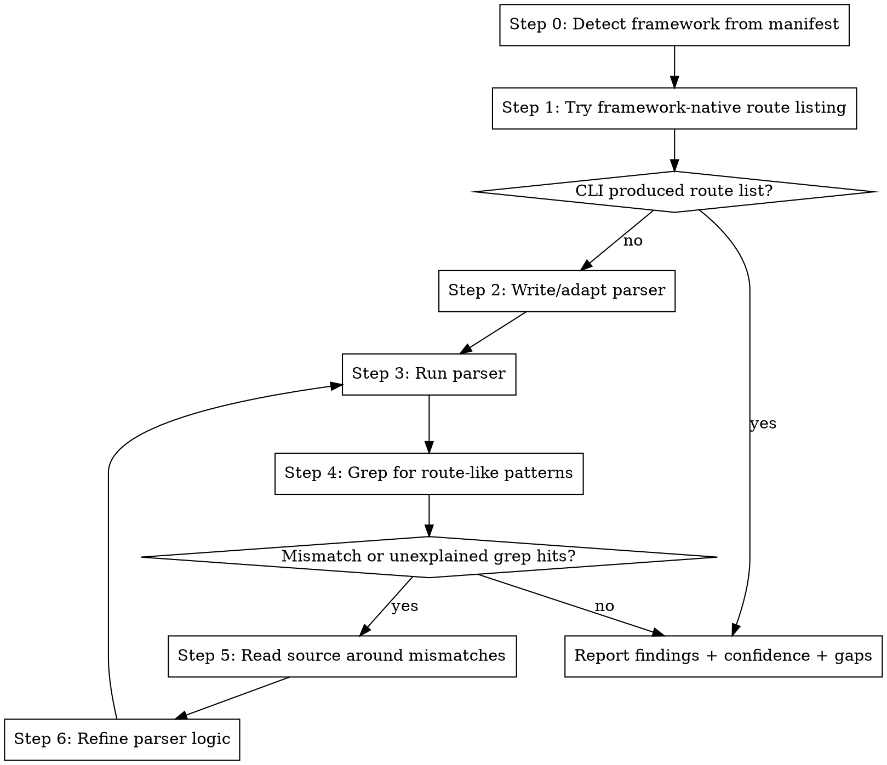

Find ALL API endpoints in this codebase.



Step 0: Identify the framework. The user message includes top imports and route-related symbols from the structural store — use these to detect the framework before doing anything else. Also check manifest files (Gemfile, package.json, pom.xml, build.gradle, go.mod, requirements.txt, CMakeLists.txt).

Step 1: Try the framework CLI (rails routes, flask routes, artisan route:list, etc). If it works, report results.

Step 2: Write a parser. Output it as a ```python code block. The system saves and runs it automatically.

## Parser Specification

Your parser must be capable of:

1. **Discovering all route definition sources**
   - Framework config files (routes.rb, urls.py, routes.yaml, web.xml)
   - Source files with route annotations, decorators, or macros
   - Plugin, module, and engine route files
   - Programmatic route registration

2. **Understanding the framework's routing DSL**
   - Expanding shorthand into individual endpoints (e.g. resources → CRUD operations)
   - Resolving nested and namespaced routes (prefixing child paths)
   - Handling route options and constraints (only, except, via)
   - Tracking scope and context through block nesting

3. **Extracting for each endpoint**
   - HTTP method (GET, POST, PUT, DELETE, PATCH, or the framework equivalent)
   - Full resolved path
   - Handler class and method
   - Source file and line number
   - Framework name and confidence score

4. **Output contract**
   - Print a single JSON array to stdout: `print(json.dumps(endpoints))`
   - Each element is a dict with keys: type, path, operation, handler_class, handler_method, file, line, direction, protocol, framework, confidence
   - No other output to stdout — no print statements, no debug logging, no progress messages

Step 3: The system runs your parser and captures the JSON array output.

Step 4: Grep for route-like patterns across the codebase — annotations, decorators, macros, route registrations. Compare the count to your parser output.

Step 5: If there are unexplained grep hits or mismatches — read the source around those lines to understand what the parser missed.

Step 6: Refine the parser logic based on what you found. Go back to Step 3.

Tools: run_framework_command(command), grep(pattern, file_glob), read_source(file_path)

Call format: TOOL_CALL: tool_name(param="value")

Report: FINAL_ANSWER [{"type":"REST","path":"/users","operation":"GET","handler_class":"UsersController","handler_method":"index","file":"routes.rb","line":10,"direction":"INBOUND","protocol":"HTTP","framework":"rails","confidence":0.95}]
