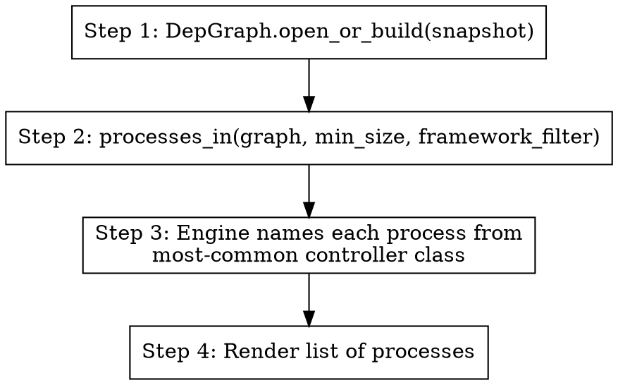

Discover logical "processes" — clusters of endpoints whose execution flows
share most of their internal symbols.



## When to use

- "What logical features does this app have?"
- "Group the REST endpoints by what they actually do."
- "Which endpoints touch the database vs the message queue?"

## How

Engine: `src.dep.processes.processes_in()` returns `list[Process]`:
- runs `flow.trace_from()` for each endpoint
- clusters endpoints with Jaccard ≥ 0.6 on flow symbol-sets
- names each cluster from the most-common controller class

Inputs:
- optional `--filter <framework>` (e.g. `--filter rails`)
- optional `--min-size N` (default 1)

Steps:
1. `graph = DepGraph.open_or_build(snapshot_path)`
2. `procs = processes_in(graph, min_size=N, framework_filter=...)`
3. Render each process:
   - name + member-count
   - the endpoints in it
   - top key symbols (most-shared across the cluster's flows)
   - downstream interactions

LLM (when available) writes a one-paragraph description per process:
> "Owners process — handles owner CRUD via 7 REST endpoints. Reads from
> the `owners` table, writes via `OwnerRepository.save`."

## Output shape

```
1. **OwnerController** (7 endpoints)
   - GET /owners
   - GET /owners/{id}
   - POST /owners
   - ...
   key symbols: OwnerRepository, OwnerValidator, ...
   interactions: db_query → owners; db_write → owners

2. **VetController** (3 endpoints)
   ...
```

## Notes for the agent

- Cluster naming is heuristic. If a name looks wrong, surface it neutrally.
- Same DB → same processes (deterministic).
- For very small repos (≤5 endpoints), each endpoint may end up its own
  cluster — that's expected; report it.
