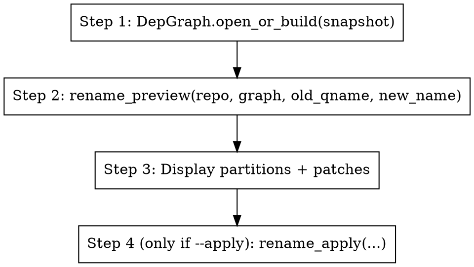

Plan and (optionally) apply a multi-file rename.

## When to use

The user wants to rename a class / method / function across the codebase
and asks "what would change?" or "rename X to Y".

## Defaults that matter

- **Preview is the default.** Never call `rename_apply` unless the user
  explicitly passed `--apply`.
- **Pass a qualified name** (e.g. `lib.Greeter`, `OwnerController.list`).
  Bare names that resolve uniquely are accepted; ambiguous bare names
  return an `ambiguous=True` plan listing candidates — surface that to the
  user and ask them to qualify.
- **`new_name` is bare.** Just the new identifier.

## Inputs

- positional: `<old_qname>` `<new_name>`
- `--apply` write changes to disk (default: preview only)
- `--include-text-only` patch refs that text-grep found but graph didn't
  (off by default — those may be string literals you don't want renamed)
- `--all-languages` text-grep across all languages, not just the symbol's
- `--force-dirty` apply on a dirty working tree (default: refuse)

## Steps

1. `graph = DepGraph.open_or_build(snapshot_path)`
2. `plan = rename_preview(repo, graph, old_qname, new_name, all_languages=...)`
3. If `plan.ambiguous`: report candidates, stop.
4. Show the user:
   - `kind` of the resolved symbol
   - graph_only / text_only / both partition counts
   - `len(plan.patches)` patches across `len(set(p.file for p in plan.patches))` files
   - First 10 patches in `before → after` form
5. If `--apply`: `rename_apply(repo, graph, plan, force_dirty=...)`. Show
   the resulting `applied` flag + the audit-log path.

## Without an LLM

Return JSON of the plan. The engine writes the audit log on apply; the
skill is just a narrator.
