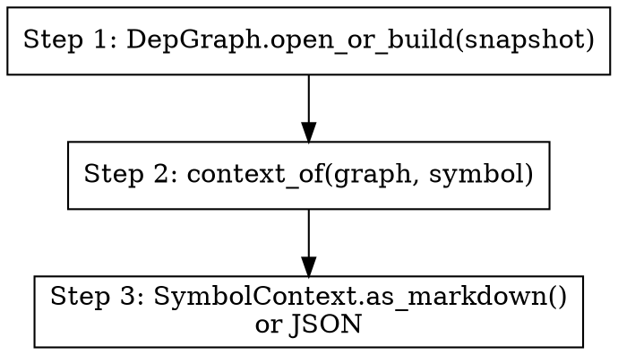

Build a 360° context view for a symbol — definition, callers, callees,
class hierarchy, endpoints handled, outbound interactions, file imports.



## When to use

When the user wants the complete picture of a single symbol before:
- editing it
- writing a test for it
- explaining it to someone

## How

Engine: `src.dep.context.context_of()` returns a `SymbolContext` with:
- definition (file, line, language, kind)
- direct callers + direct callees (1 hop)
- parents + children (inheritance, 1 hop)
- endpoints whose handler is this symbol
- outbound interactions sourced here
- imports in the same file

Inputs:
- `symbol` — qualified_name (preferred) or bare name

Steps:
1. `graph = DepGraph.open_or_build(snapshot_path)`
2. `ctx = context_of(graph, symbol)`
3. Render:
   - `ctx.as_markdown()` for the standard output
   - LLM may add a one-paragraph "what this symbol does" preamble
4. If `ctx.notes` flags multiple matches, surface that.

## Output shape

```
## OwnerController.list
**kind:** `method` &nbsp; **file:** `src/.../OwnerController.java:42` &nbsp; **lang:** `java`

### Direct callers (3)
- `OwnerController.find`
- ...

### Direct callees (5)
- `OwnerRepository.findAll`
- ...

### Endpoints handled (1)
- `GET /owners`

### Outbound interactions (1)
- `db_query` → `owners`
```

## Notes for the agent

- The engine truncates long lists at 20 items in markdown render — for
  full lists, output JSON instead.
- File path is repo-relative (forward slashes).
