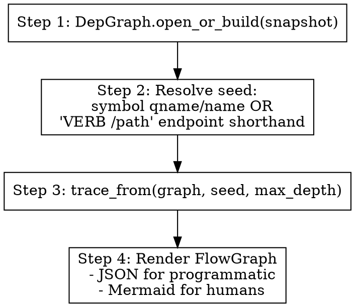

Trace execution flow from a seed (symbol or endpoint) through callees,
inheritance overrides, and external interactions.

## When to use

- "How does feature X work end-to-end?"
- "Show me what `GET /owners` does."
- "Trace down to the database / HTTP / queue calls from this entry point."

## How

Engine: `src.dep.flow.trace_from()` returns a `FlowGraph` (nodes + edges).
`src.dep.flow.to_mermaid()` renders Mermaid.

Inputs:
- `seed` — symbol qname, bare name, or `"VERB /path"`
- optional `--format json|mermaid` (default `mermaid`)
- optional `--max-depth N` (default 10; engine caps at 100 nodes regardless)

Steps:
1. `graph = DepGraph.open_or_build(snapshot_path)`
2. `fg = trace_from(graph, seed, max_depth=N)`
3. If `fg.notes` includes "could not resolve seed" — suggest near-matches
   from the symbols table.
4. Format:
   - `mermaid` — output the `to_mermaid(fg)` block
   - `json` — serialise nodes + edges as compact JSON

## Output shape

Mermaid:

Plain narration (when LLM is available):
> The `GET /owners` endpoint dispatches to `OwnerController.list`, which
> queries the `owners` table and returns the result. No external HTTP /
> queue interactions in this flow.

## Notes for the agent

- Sinks (interactions) are end-of-line — don't traverse past them.
- Inheritance overrides appear as dotted edges labelled `override`.
- If the flow truncates (>100 nodes), surface that explicitly so the user
  knows to drill deeper with a tighter seed.
