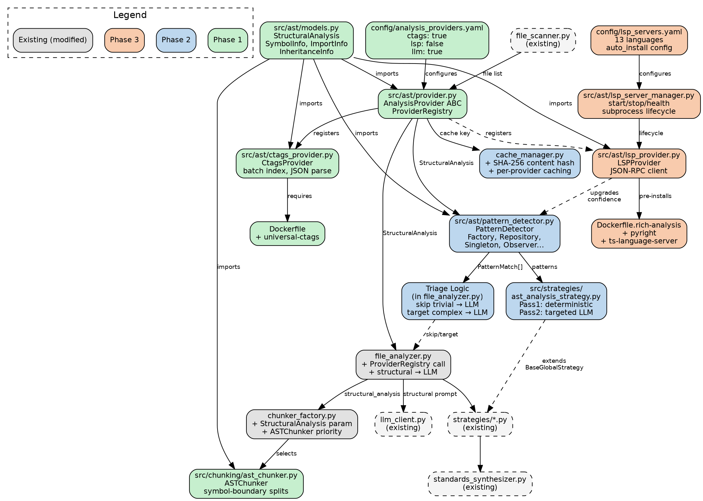

# AST Code Analysis — Implementation Plan & Architecture

## Phase Overview

| Phase | Scope | Deliverables | Effort |
|-------|-------|-------------|--------|
| **Phase 1** | ctags + pipeline integration | Token reduction, AST chunking, structural data in pipeline | ~3-4 days |
| **Phase 2** | Pattern detection + strategy + caching | Design pattern heuristics, triage, new strategy, file-level caching | ~2-3 days |
| **Phase 3** | LSP integration | Deep analysis (call graphs, references, types), Docker variants | ~4-5 days |

---

## Phase 1 — ctags + Pipeline Integration

**Goal:** Get structural data flowing through the pipeline. LLM receives ctags output instead of raw code. AST-aware chunking replaces line-count splitting.

### Files Created
| File | Purpose |
|------|---------|
| `src/ast/__init__.py` | Package init |
| `src/ast/models.py` | `StructuralAnalysis`, `SymbolInfo`, `InheritanceInfo`, `ImportInfo` |
| `src/ast/provider.py` | `AnalysisProvider` ABC, `ProviderRegistry` |
| `src/ast/ctags_provider.py` | `CtagsProvider` — batch ctags invocation, JSON parsing |
| `src/chunking/ast_chunker.py` | `ASTChunker` — symbol-boundary chunking |
| `config/analysis_providers.yaml` | Toggle config (ctags + LLM enabled by default) |

### Files Modified
| File | Change |
|------|--------|
| `src/chunking/chunker_factory.py` | Accept optional `StructuralAnalysis`, prefer `ASTChunker` |
| `src/file_analyzer.py` | Call `ProviderRegistry.analyze_file()` before LLM, pass structural data to prompts |
| `Dockerfile` | Add `apt-get install -y universal-ctags` |
| `requirements.txt` | Add `pyyaml` (if not present, for config loading) |

### Architecture (Phase 1)

```
       ┌──────────────┐
       │ file_scanner  │
       └──────┬───────┘
              │ file list
              ▼
       ┌──────────────┐
       │ProviderRegistry│
       │  (Phase 1)   │
       └──────┬───────┘
              │
       ┌──────┴───────┐
       │ CtagsProvider │
       │  batch index  │
       │  JSON parse   │
       └──────┬───────┘
              │ StructuralAnalysis per file
              ▼
    ┌─────────────────┐
    │  file_analyzer   │
    │                  │
    │  if structural:  │
    │    format output │──→ LLM (structural data, ~200 tokens)
    │  else:           │
    │    raw code      │──→ LLM (legacy, ~2000+ tokens)
    └────────┬────────┘
             │
    ┌────────┴────────┐
    │ chunker_factory  │
    │                  │
    │  AST available?  │
    │  ├─ yes → ASTChunker (symbol boundaries)
    │  └─ no  → GenericChunker (line-count)
    └────────┬────────┘
             │
             ▼
    ┌─────────────────┐
    │  strategies/*.py │
    │  (unchanged)     │
    └────────┬────────┘
             │
             ▼
    ┌─────────────────┐
    │ standards_synth  │
    └─────────────────┘
```

---

## Phase 2 — Pattern Detection + Strategy + Caching

**Goal:** Add deterministic design pattern detection from structural data. New strategy that replaces Pass 1 with structural analysis. File-level caching by content hash.

### Files Created
| File | Purpose |
|------|---------|
| `src/ast/pattern_detector.py` | `PatternDetector` — heuristic rules on `StructuralAnalysis` |
| `src/strategies/ast_analysis_strategy.py` | New strategy extending `BaseGlobalStandardStrategy` |

### Files Modified
| File | Change |
|------|--------|
| `src/ast/models.py` | Add `PatternMatch`, `CallInfo` models |
| `src/file_analyzer.py` | Add triage logic (skip trivial files from LLM) |
| `src/cache_manager.py` | Add structural analysis caching (SHA-256 content hash) |
| `src/strategies/__init__.py` | Register `AstAnalysisStrategy` |

### Architecture (Phase 2 additions)

```
       ┌──────────────┐
       │ CtagsProvider │
       └──────┬───────┘
              │ StructuralAnalysis
              ├──────────────────────────┐
              ▼                          ▼
    ┌─────────────────┐       ┌──────────────────┐
    │ PatternDetector  │       │   cache_manager   │
    │                  │       │                   │
    │ Factory    0.8   │       │ key: sha256(content)
    │ Repository 0.8   │       │ + provider_name   │
    │ Singleton  0.5   │       │                   │
    │ Observer   0.8   │       │ hit? → skip ctags │
    │ Strategy   0.8   │       │ miss? → analyze   │
    └────────┬────────┘       └───────────────────┘
             │ PatternMatch[]
             ▼
    ┌─────────────────────┐
    │ Triage (file_analyzer)│
    │                      │
    │ Complex classes,     │
    │ deep inheritance,    │──→ LLM interpretation (structural data)
    │ unusual patterns     │
    │                      │
    │ Simple data classes, │
    │ boilerplate,         │──→ Skip LLM (structural data sufficient)
    │ generated code       │
    └──────────┬──────────┘
               │
               ▼
    ┌──────────────────────┐
    │ AstAnalysisStrategy   │
    │                       │
    │ Pass 1: deterministic │ ← replaces LLM sampling
    │   (ctags structural)  │
    │ Pass 2: targeted LLM  │ ← structural data + snippets
    │ Pass 3: synthesize    │
    └───────────────────────┘
```

---

## Phase 3 — LSP Integration

**Goal:** Add deep analysis tier — call graphs, cross-file references, type info. Pre-baked Docker variants. Confidence scores upgraded from 0.8 → 1.0 with LSP evidence.

### Files Created
| File | Purpose |
|------|---------|
| `src/ast/lsp_provider.py` | `LSPProvider` — server lifecycle, JSON-RPC client |
| `src/ast/lsp_server_manager.py` | `LSPServerManager` — start/stop/health check |
| `config/lsp_servers.yaml` | Server registry (13 languages, install commands, toggles) |
| `Dockerfile.rich-analysis` | Docker variant with pyright + typescript-language-server |

### Files Modified
| File | Change |
|------|--------|
| `src/ast/provider.py` | Register `LSPProvider` in `ProviderRegistry` |
| `src/ast/models.py` | Add `CallInfo` enrichment from LSP |
| `src/ast/pattern_detector.py` | Upgrade confidence with LSP evidence (0.8 → 1.0) |
| `config/analysis_providers.yaml` | Add LSP toggle |
| `requirements.txt` | Add `lsprotocol` |

### Architecture (Phase 3 — Full Stack)

```
       ┌──────────────┐
       │ file_scanner   │
       └──────┬────────┘
              │ file list + detected languages
              ▼
       ┌──────────────────┐
       │ ProviderRegistry  │
       │   (Full Stack)    │
       └──┬──────┬──────┬─┘
          │      │      │
     ┌────┴──┐ ┌┴─────┐│
     │ ctags ││ │ LSP  ││
     │ Tier1 ││ │Tier2 ││
     │       ││ │      ││
     │ batch ││ │per-  ││
     │ index ││ │lang  ││
     │ ~1s   ││ │server││
     └───┬───┘│ └──┬───┘│
         │    │    │     │
         └────┼────┘     │
              │          │
              ▼          │
    ┌─────────────────┐  │
    │ Merge into       │  │
    │ StructuralAnalysis│ │
    │                   │ │
    │ symbols (ctags)   │ │
    │ + calls (LSP)     │ │
    │ + refs (LSP)      │ │
    │ + types (LSP)     │ │
    │ + lang ver (LSP)  │ │
    └────────┬─────────┘ │
             │            │
             ▼            │
    ┌────────────────┐    │
    │PatternDetector  │    │
    │                 │    │
    │ ctags: conf 0.8 │    │
    │ +LSP:  conf 1.0 │    │
    └────────┬───────┘    │
             │             │
             ▼             │
    ┌─────────────────┐    │
    │ Triage + Cache   │    │
    └────────┬────────┘    │
             │              │
             ▼              │
    ┌─────────────────┐     │
    │ LLM (if enabled) │◄───┘
    │  structural data │
    │  ~200-400 tokens │
    └────────┬────────┘
             │
             ▼
    ┌─────────────────┐
    │ strategies +     │
    │ synthesizer      │
    └─────────────────┘
```

---

## Dependency Graph (DOT)



---

## Implementation Order (within each phase)

### Phase 1 — Sequential build order
```
1. src/ast/models.py          ← no dependencies, pure data models
2. src/ast/provider.py         ← depends on models
3. src/ast/ctags_provider.py   ← depends on provider + models
4. Dockerfile                  ← add universal-ctags
5. config/analysis_providers.yaml
6. src/chunking/ast_chunker.py ← depends on models
7. src/chunking/chunker_factory.py (modify)
8. src/file_analyzer.py (modify)
9. Tests for ctags_provider + ast_chunker
```

### Phase 2 — Sequential build order
```
1. src/ast/models.py           ← add PatternMatch
2. src/ast/pattern_detector.py ← depends on models
3. src/file_analyzer.py        ← add triage logic
4. src/cache_manager.py        ← add structural caching
5. src/strategies/ast_analysis_strategy.py
6. Tests for pattern_detector + triage + caching
```

### Phase 3 — Sequential build order
```
1. config/lsp_servers.yaml
2. src/ast/lsp_server_manager.py
3. src/ast/lsp_provider.py     ← depends on manager + models
4. src/ast/provider.py         ← register LSP provider
5. src/ast/pattern_detector.py ← LSP confidence upgrades
6. Dockerfile.rich-analysis
7. requirements.txt            ← add lsprotocol
8. Tests for lsp_provider + integration
```
