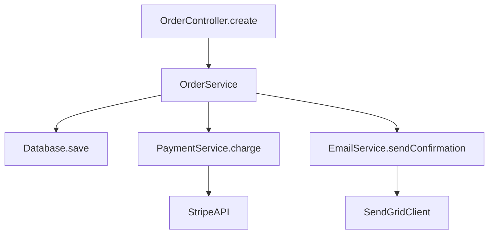
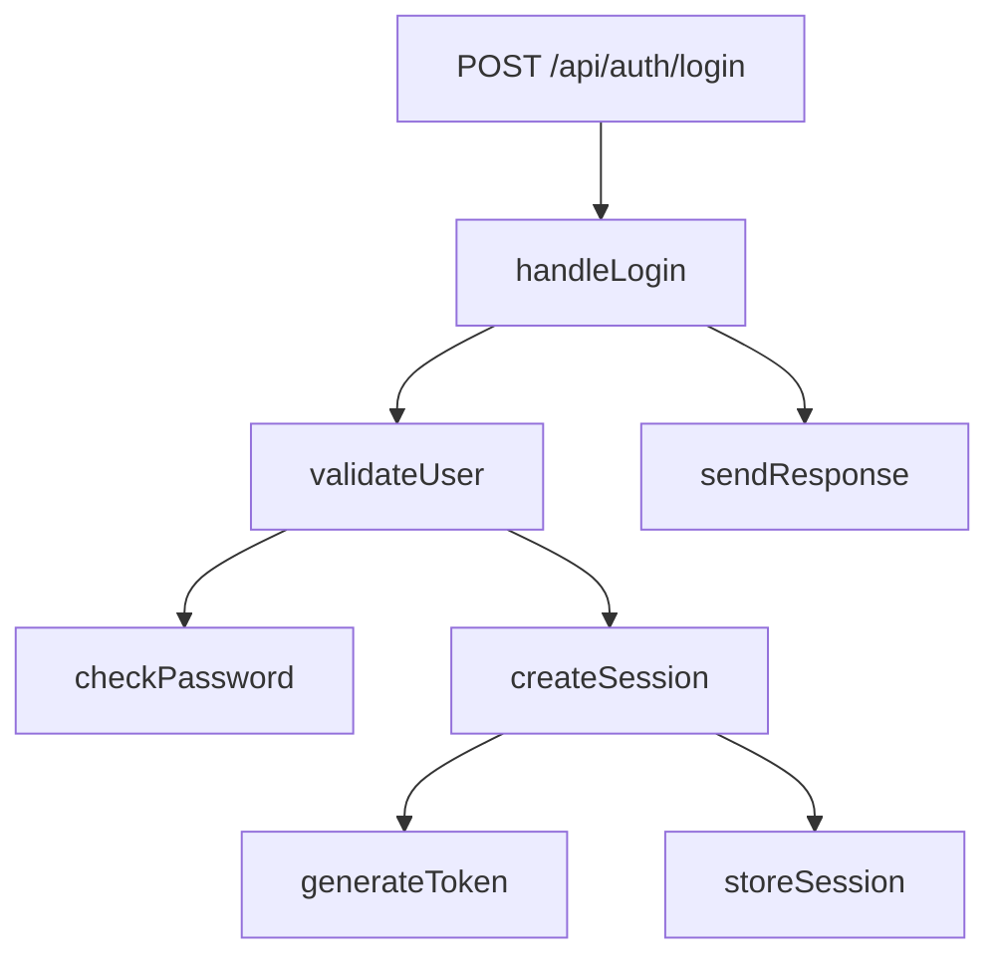

# Implementation Spec: Deep Dependency Analysis for Standards Extractor

**Version:** 1.0  
**Created:** 2026-04-24  
**Status:** Draft  
**Target:** Standards Extractor Python Application  

---

## Executive Summary

Add deep dependency analysis capabilities to Standards Extractor, enabling multi-hop dependency traversal, blast radius analysis, and execution flow tracing. This will allow users to understand the full impact of code changes before making them, complementing the existing standards extraction features.

**Key Differences from GitNexus:**
- **Python-based** (not TypeScript)
- **Haikai skills** (not MCP tools)
- **REST API endpoints** (not MCP stdio)
- **SQLite graph storage** (not LadybugDB)
- **Integrated with existing AST pipeline** (ctags + tree-sitter already in place)

---

## Table of Contents

1. [Architecture Overview](#architecture-overview)
2. [Database Schema](#database-schema)
3. [Ingestion Pipeline Extensions](#ingestion-pipeline-extensions)
4. [Core Analysis Engine](#core-analysis-engine)
5. [Haikai Skills](#haikai-skills)
6. [REST API Endpoints](#rest-api-endpoints)
7. [Python Modules](#python-modules)
8. [Implementation Tasks](#implementation-tasks)
9. [Testing Strategy](#testing-strategy)
10. [Performance Considerations](#performance-considerations)
11. [Migration Path](#migration-path)

---

## 1. Architecture Overview

### High-Level Architecture

```
┌─────────────────────────────────────────────────────────────┐
│                    FastAPI Application                       │
│                      (src/api.py)                           │
│                                                              │
│  New Endpoints:                                              │
│  • POST /api/v1/analyze-dependencies                        │
│  • POST /api/v1/dependency-graph/query                      │
│  • POST /api/v1/dependency-graph/impact                     │
│  • POST /api/v1/dependency-graph/context                    │
│  • POST /api/v1/dependency-graph/processes                  │
│  • GET  /api/v1/dependency-graph/{company}/{project}/stats  │
└──────────────┬──────────────────────────────────────────────┘
               │
      ┌────────▼────────┐
      │ DependencyGraph │
      │   Orchestrator  │
      │                 │
      │ New module:     │
      │ dependency_     │
      │ orchestrator.py │
      └────────┬────────┘
               │
      ┌────────▼─────────────────────────────────────┐
      │         Core Analysis Engines                 │
      │                                               │
      │  ┌─────────────────┐  ┌───────────────────┐ │
      │  │ ImpactAnalyzer  │  │ ProcessTracer     │ │
      │  │                 │  │                   │ │
      │  │ impact_         │  │ process_          │ │
      │  │ analyzer.py     │  │ tracer.py         │ │
      │  └─────────────────┘  └───────────────────┘ │
      │                                               │
      │  ┌─────────────────┐  ┌───────────────────┐ │
      │  │ ContextBuilder  │  │ GraphQueryEngine  │ │
      │  │                 │  │                   │ │
      │  │ context_        │  │ graph_query.py    │ │
      │  │ builder.py      │  │                   │ │
      │  └─────────────────┘  └───────────────────┘ │
      └────────┬──────────────────────────────────────┘
               │
      ┌────────▼────────┐
      │  Graph Storage  │
      │                 │
      │  SQLite with:   │
      │  • Nodes table  │
      │  • Edges table  │
      │  • Indexes      │
      │                 │
      │  graph_store.py │
      └────────┬────────┘
               │
      ┌────────▼────────────────────────────────────┐
      │      Existing AST Infrastructure            │
      │                                              │
      │  • CtagsProvider (src/ast/ctags_provider.py)│
      │  • TreeSitterProvider (treesitter_...)      │
      │  • Language Extractors (extractors/*.py)    │
      │  • FileStore (store.py)                     │
      └─────────────────────────────────────────────┘
```

### Data Flow

```
Source Code
    │
    ▼
Existing AST Pipeline (ctags + tree-sitter)
    │
    ├─→ _index.txt (symbols)
    ├─→ _calls.txt (call edges)
    ├─→ _imports.txt (import edges)
    └─→ _inheritance.txt (class hierarchy)
    │
    ▼
Graph Builder (NEW)
    │
    ├─→ Parse flat text files
    ├─→ Build in-memory graph
    └─→ Store in SQLite
    │
    ▼
Analysis Engines (NEW)
    │
    ├─→ ImpactAnalyzer (blast radius)
    ├─→ ProcessTracer (execution flows)
    ├─→ ContextBuilder (360° view)
    └─→ GraphQueryEngine (SQL queries)
    │
    ▼
Haikai Skills (NEW)
    │
    ├─→ /analyze-impact
    ├─→ /trace-dependencies
    ├─→ /show-context
    └─→ /find-processes
    │
    ▼
REST API Endpoints (NEW)
```

### Integration Points with Existing Codebase

1. **AST Pipeline** (`src/ast/`)
   - **Reads from:** `_calls.txt`, `_imports.txt`, `_inheritance.txt`, `_index.txt`
   - **No modifications needed** to existing AST code
   - Graph builder consumes AST outputs

2. **API Layer** (`src/api.py`)
   - **Add new endpoints** for dependency analysis
   - **Reuse auth:** Existing `STANDARDS_API_KEY` bearer token
   - **Integrate with:** Existing `company/project` workspace pattern

3. **Haikai Skills** (`haikai-profiles/default/commands/`)
   - **Add new skills:** dependency analysis commands
   - **Reuse:** Existing skill injection mechanism
   - **Pattern:** Same as `/write-spec`, `/create-tasks`, etc.

4. **Database** (SQLite)
   - **New database file:** `{company}/{project}/dependency_graph.db`
   - **Separate from:** job queue database
   - **Located in:** `api_workspace/{company}/{project}/`

---

## 2. Database Schema

### SQLite Schema Design

#### Nodes Table
```sql
CREATE TABLE nodes (
    id INTEGER PRIMARY KEY AUTOINCREMENT,
    uid TEXT UNIQUE NOT NULL,           -- e.g., "Function:validateUser"
    name TEXT NOT NULL,                 -- e.g., "validateUser"
    kind TEXT NOT NULL,                 -- Function, Class, Method, Interface, etc.
    file_path TEXT NOT NULL,            -- Relative path from project root
    start_line INTEGER,
    end_line INTEGER,
    signature TEXT,                     -- Function signature or type annotation
    language TEXT,                      -- python, typescript, go, etc.
    is_test BOOLEAN DEFAULT 0,
    is_entry_point BOOLEAN DEFAULT 0,   -- Routes, main(), CLI commands
    entry_priority REAL,                -- 0.0-1.0 for entry points
    metadata JSON,                      -- Additional language-specific data
    created_at TIMESTAMP DEFAULT CURRENT_TIMESTAMP,
    
    -- Indexes
    INDEX idx_nodes_uid ON nodes(uid),
    INDEX idx_nodes_name ON nodes(name),
    INDEX idx_nodes_kind ON nodes(kind),
    INDEX idx_nodes_file ON nodes(file_path),
    INDEX idx_nodes_entry ON nodes(is_entry_point)
);
```

#### Edges Table
```sql
CREATE TABLE edges (
    id INTEGER PRIMARY KEY AUTOINCREMENT,
    source_id INTEGER NOT NULL,
    target_id INTEGER NOT NULL,
    relation_type TEXT NOT NULL,        -- CALLS, IMPORTS, EXTENDS, IMPLEMENTS, OVERRIDES
    confidence REAL DEFAULT 1.0,        -- 0.0-1.0 confidence score
    weight REAL DEFAULT 1.0,            -- For graph algorithms
    metadata JSON,                      -- Context (line number, arity, etc.)
    created_at TIMESTAMP DEFAULT CURRENT_TIMESTAMP,
    
    FOREIGN KEY (source_id) REFERENCES nodes(id) ON DELETE CASCADE,
    FOREIGN KEY (target_id) REFERENCES nodes(id) ON DELETE CASCADE,
    
    -- Indexes
    INDEX idx_edges_source ON edges(source_id),
    INDEX idx_edges_target ON edges(target_id),
    INDEX idx_edges_type ON edges(relation_type),
    INDEX idx_edges_confidence ON edges(confidence),
    UNIQUE(source_id, target_id, relation_type)
);
```

#### Clusters Table
```sql
CREATE TABLE clusters (
    id INTEGER PRIMARY KEY AUTOINCREMENT,
    name TEXT NOT NULL,                 -- e.g., "Authentication"
    label TEXT,                         -- Heuristic or LLM-generated label
    cohesion REAL,                      -- 0.0-1.0 cohesion score
    size INTEGER,                       -- Number of nodes
    algorithm TEXT DEFAULT 'louvain',   -- Clustering algorithm used
    metadata JSON,
    created_at TIMESTAMP DEFAULT CURRENT_TIMESTAMP,
    
    INDEX idx_clusters_name ON clusters(name)
);
```

#### Cluster Memberships Table
```sql
CREATE TABLE cluster_memberships (
    id INTEGER PRIMARY KEY AUTOINCREMENT,
    cluster_id INTEGER NOT NULL,
    node_id INTEGER NOT NULL,
    
    FOREIGN KEY (cluster_id) REFERENCES clusters(id) ON DELETE CASCADE,
    FOREIGN KEY (node_id) REFERENCES nodes(id) ON DELETE CASCADE,
    
    UNIQUE(cluster_id, node_id),
    INDEX idx_cm_cluster ON cluster_memberships(cluster_id),
    INDEX idx_cm_node ON cluster_memberships(node_id)
);
```

#### Processes Table
```sql
CREATE TABLE processes (
    id INTEGER PRIMARY KEY AUTOINCREMENT,
    name TEXT NOT NULL,                 -- e.g., "LoginFlow"
    entry_point_id INTEGER,             -- Node ID of entry point
    process_type TEXT,                  -- intra_community, cross_community
    step_count INTEGER,
    priority REAL,                      -- Based on entry point priority
    metadata JSON,
    created_at TIMESTAMP DEFAULT CURRENT_TIMESTAMP,
    
    FOREIGN KEY (entry_point_id) REFERENCES nodes(id) ON DELETE SET NULL,
    
    INDEX idx_processes_name ON processes(name),
    INDEX idx_processes_type ON processes(process_type),
    INDEX idx_processes_priority ON processes(priority)
);
```

#### Process Steps Table
```sql
CREATE TABLE process_steps (
    id INTEGER PRIMARY KEY AUTOINCREMENT,
    process_id INTEGER NOT NULL,
    node_id INTEGER NOT NULL,
    step_index INTEGER NOT NULL,        -- Order in the process (0, 1, 2, ...)
    depth INTEGER,                      -- Call depth from entry point
    
    FOREIGN KEY (process_id) REFERENCES processes(id) ON DELETE CASCADE,
    FOREIGN KEY (node_id) REFERENCES nodes(id) ON DELETE CASCADE,
    
    UNIQUE(process_id, node_id, step_index),
    INDEX idx_ps_process ON process_steps(process_id),
    INDEX idx_ps_node ON process_steps(node_id)
);
```

#### Analysis Cache Table
```sql
CREATE TABLE analysis_cache (
    id INTEGER PRIMARY KEY AUTOINCREMENT,
    cache_key TEXT UNIQUE NOT NULL,     -- Hash of query parameters
    analysis_type TEXT NOT NULL,        -- impact, context, process, etc.
    result JSON NOT NULL,               -- Cached result
    expires_at TIMESTAMP,
    created_at TIMESTAMP DEFAULT CURRENT_TIMESTAMP,
    
    INDEX idx_cache_key ON analysis_cache(cache_key),
    INDEX idx_cache_type ON analysis_cache(analysis_type),
    INDEX idx_cache_expires ON analysis_cache(expires_at)
);
```

#### Graph Metadata Table
```sql
CREATE TABLE graph_metadata (
    key TEXT PRIMARY KEY,
    value TEXT NOT NULL,
    updated_at TIMESTAMP DEFAULT CURRENT_TIMESTAMP
);

-- Default metadata entries
INSERT INTO graph_metadata (key, value) VALUES
    ('version', '1.0'),
    ('last_build', CURRENT_TIMESTAMP),
    ('source_commit', ''),              -- Git commit hash
    ('node_count', '0'),
    ('edge_count', '0'),
    ('cluster_count', '0'),
    ('process_count', '0');
```

---

## 3. Ingestion Pipeline Extensions

### Current AST Pipeline (Existing)

Located in `src/ast/`:
1. **CtagsProvider** → `_index.txt`, `_inheritance.txt`
2. **TreeSitterProvider** → `_calls.txt`, `_imports.txt`, `_assignments.txt`
3. **FileStore** → Writes flat text files

### New Graph Builder Pipeline

**Location:** `src/dependency/graph_builder.py`

```python
"""
Graph Builder Pipeline

Converts flat AST text files into a queryable dependency graph in SQLite.
"""

from pathlib import Path
from typing import Dict, List, Set, Tuple
import re
import json
from dataclasses import dataclass
from enum import Enum

from src.dependency.graph_store import GraphStore
from src.ast.store import get_structural_dir


class NodeKind(str, Enum):
    """Node types in the dependency graph."""
    FUNCTION = "Function"
    CLASS = "Class"
    METHOD = "Method"
    INTERFACE = "Interface"
    TYPE = "Type"
    VARIABLE = "Variable"
    MODULE = "Module"
    CONSTANT = "Constant"


class RelationType(str, Enum):
    """Edge types in the dependency graph."""
    CALLS = "CALLS"
    IMPORTS = "IMPORTS"
    EXTENDS = "EXTENDS"
    IMPLEMENTS = "IMPLEMENTS"
    OVERRIDES = "OVERRIDES"
    CONTAINS = "CONTAINS"


@dataclass
class ParsedNode:
    """Intermediate representation of a parsed node."""
    uid: str
    name: str
    kind: NodeKind
    file_path: str
    start_line: int
    end_line: int
    signature: str = ""
    language: str = ""
    is_test: bool = False
    metadata: Dict = None


@dataclass
class ParsedEdge:
    """Intermediate representation of a parsed edge."""
    source_uid: str
    target_uid: str
    relation_type: RelationType
    confidence: float = 1.0
    metadata: Dict = None


class GraphBuilder:
    """
    Builds a dependency graph from AST structural analysis outputs.
    
    Input: Flat text files (_index.txt, _calls.txt, etc.)
    Output: SQLite database with nodes, edges, clusters, processes
    """
    
    def __init__(self, company: str, project: str):
        self.company = company
        self.project = project
        self.store = GraphStore(company, project)
        
        # Caches for deduplication
        self.node_cache: Dict[str, int] = {}  # uid -> db_id
        self.edge_cache: Set[Tuple[str, str, str]] = set()
        
    def build(self, force: bool = False) -> Dict:
        """
        Main entry point: Build complete dependency graph.
        
        Args:
            force: If True, rebuild even if graph exists
            
        Returns:
            Stats dict with counts and timing
        """
        import time
        start = time.time()
        
        # Check if rebuild needed
        if not force and self.store.is_current():
            return {"status": "cached", "message": "Graph is up to date"}
        
        print(f"Building dependency graph for {self.company}/{self.project}...")
        
        # Clear existing graph
        self.store.clear()
        
        # Phase 1: Parse nodes from _index.txt
        print("  [1/6] Parsing symbols...")
        nodes = self._parse_index_file()
        print(f"        Found {len(nodes)} symbols")
        
        # Phase 2: Insert nodes into database
        print("  [2/6] Storing nodes...")
        self._insert_nodes(nodes)
        
        # Phase 3: Parse edges from _calls.txt, _imports.txt, _inheritance.txt
        print("  [3/6] Parsing relationships...")
        edges = self._parse_relationship_files()
        print(f"        Found {len(edges)} relationships")
        
        # Phase 4: Insert edges into database
        print("  [4/6] Storing edges...")
        self._insert_edges(edges)
        
        # Phase 5: Detect clusters (communities)
        print("  [5/6] Detecting functional clusters...")
        clusters = self._detect_clusters()
        print(f"        Found {clusters} clusters")
        
        # Phase 6: Trace execution processes
        print("  [6/6] Tracing execution flows...")
        processes = self._trace_processes()
        print(f"        Found {processes} processes")
        
        # Update metadata
        stats = self.store.get_stats()
        self.store.update_metadata({
            'last_build': time.time(),
            'node_count': stats['nodes'],
            'edge_count': stats['edges'],
            'cluster_count': stats['clusters'],
            'process_count': stats['processes']
        })
        
        elapsed = time.time() - start
        print(f"  ✓ Graph built in {elapsed:.2f}s")
        
        return {
            "status": "success",
            "stats": stats,
            "elapsed_seconds": elapsed
        }
    
    def _parse_index_file(self) -> List[ParsedNode]:
        """
        Parse _index.txt to extract all symbols.
        
        Format (from ctags):
        symbol_name    file_path:line    kind    signature    language
        
        Example:
        validateUser   src/auth.py:15    function    (credentials: dict) -> User    python
        """
        nodes = []
        index_file = self._get_structural_file("_index.txt")
        
        if not index_file.exists():
            return nodes
        
        with open(index_file) as f:
            for line_num, line in enumerate(f, 1):
                line = line.strip()
                if not line or line.startswith('#'):
                    continue
                
                try:
                    parts = line.split('\t')
                    if len(parts) < 4:
                        continue
                    
                    name = parts[0]
                    location = parts[1]  # "file:line" or "file:line-endline"
                    kind = parts[2]
                    signature = parts[3] if len(parts) > 3 else ""
                    language = parts[4] if len(parts) > 4 else ""
                    
                    # Parse location
                    file_path, line_info = location.split(':', 1)
                    if '-' in line_info:
                        start_line, end_line = map(int, line_info.split('-'))
                    else:
                        start_line = end_line = int(line_info)
                    
                    # Build UID: Kind:QualifiedName
                    uid = self._build_uid(kind, name, file_path)
                    
                    # Check if test file
                    is_test = self._is_test_file(file_path)
                    
                    node = ParsedNode(
                        uid=uid,
                        name=name,
                        kind=NodeKind(kind.capitalize()) if kind.lower() in ['function', 'class', 'method', 'interface', 'type', 'variable'] else NodeKind.FUNCTION,
                        file_path=file_path,
                        start_line=start_line,
                        end_line=end_line,
                        signature=signature,
                        language=language,
                        is_test=is_test,
                        metadata={}
                    )
                    
                    nodes.append(node)
                    
                except Exception as e:
                    print(f"Warning: Failed to parse line {line_num}: {e}")
                    continue
        
        return nodes
    
    def _parse_relationship_files(self) -> List[ParsedEdge]:
        """
        Parse relationship files to extract edges.
        
        Files:
        - _calls.txt: CALLS edges
        - _imports.txt: IMPORTS edges
        - _inheritance.txt: EXTENDS/IMPLEMENTS edges
        """
        edges = []
        
        # Parse calls
        edges.extend(self._parse_calls_file())
        
        # Parse imports
        edges.extend(self._parse_imports_file())
        
        # Parse inheritance
        edges.extend(self._parse_inheritance_file())
        
        return edges
    
    def _parse_calls_file(self) -> List[ParsedEdge]:
        """
        Parse _calls.txt to extract CALLS edges.
        
        Format (from tree-sitter):
        caller_name    callee_name    caller_file:line    callee_file:line    confidence
        
        Example:
        handleLogin    validateUser    src/api.py:45    src/auth.py:15    0.90
        """
        edges = []
        calls_file = self._get_structural_file("_calls.txt")
        
        if not calls_file.exists():
            return edges
        
        with open(calls_file) as f:
            for line in f:
                line = line.strip()
                if not line or line.startswith('#'):
                    continue
                
                try:
                    parts = line.split('\t')
                    if len(parts) < 4:
                        continue
                    
                    caller_name = parts[0]
                    callee_name = parts[1]
                    caller_location = parts[2]  # "file:line"
                    callee_location = parts[3]
                    confidence = float(parts[4]) if len(parts) > 4 else 0.85
                    
                    # Build UIDs
                    caller_file, _ = caller_location.split(':', 1)
                    callee_file, _ = callee_location.split(':', 1)
                    
                    # Simplified UID matching (would need refinement)
                    source_uid = f"Function:{caller_name}"
                    target_uid = f"Function:{callee_name}"
                    
                    edge = ParsedEdge(
                        source_uid=source_uid,
                        target_uid=target_uid,
                        relation_type=RelationType.CALLS,
                        confidence=confidence,
                        metadata={
                            'caller_location': caller_location,
                            'callee_location': callee_location
                        }
                    )
                    
                    edges.append(edge)
                    
                except Exception as e:
                    print(f"Warning: Failed to parse call edge: {e}")
                    continue
        
        return edges
    
    def _parse_imports_file(self) -> List[ParsedEdge]:
        """Parse _imports.txt to extract IMPORTS edges."""
        # Similar implementation to _parse_calls_file
        # Format: importer_file    imported_module    line
        edges = []
        imports_file = self._get_structural_file("_imports.txt")
        
        if not imports_file.exists():
            return edges
        
        # Implementation details...
        
        return edges
    
    def _parse_inheritance_file(self) -> List[ParsedEdge]:
        """Parse _inheritance.txt to extract EXTENDS/IMPLEMENTS edges."""
        # Similar implementation
        # Format: child_class    parent_class/interface    file:line    type
        edges = []
        inheritance_file = self._get_structural_file("_inheritance.txt")
        
        if not inheritance_file.exists():
            return edges
        
        # Implementation details...
        
        return edges
    
    def _insert_nodes(self, nodes: List[ParsedNode]):
        """Insert nodes into database with deduplication."""
        for node in nodes:
            node_id = self.store.insert_node(
                uid=node.uid,
                name=node.name,
                kind=node.kind.value,
                file_path=node.file_path,
                start_line=node.start_line,
                end_line=node.end_line,
                signature=node.signature,
                language=node.language,
                is_test=node.is_test,
                metadata=node.metadata
            )
            self.node_cache[node.uid] = node_id
    
    def _insert_edges(self, edges: List[ParsedEdge]):
        """Insert edges into database with deduplication."""
        for edge in edges:
            # Check if both nodes exist
            if edge.source_uid not in self.node_cache:
                print(f"Warning: Source node not found: {edge.source_uid}")
                continue
            if edge.target_uid not in self.node_cache:
                print(f"Warning: Target node not found: {edge.target_uid}")
                continue
            
            # Deduplicate
            edge_key = (edge.source_uid, edge.target_uid, edge.relation_type.value)
            if edge_key in self.edge_cache:
                continue
            
            source_id = self.node_cache[edge.source_uid]
            target_id = self.node_cache[edge.target_uid]
            
            self.store.insert_edge(
                source_id=source_id,
                target_id=target_id,
                relation_type=edge.relation_type.value,
                confidence=edge.confidence,
                metadata=edge.metadata
            )
            
            self.edge_cache.add(edge_key)
    
    def _detect_clusters(self) -> int:
        """
        Detect functional clusters using Louvain community detection.
        
        Uses networkx library for community detection.
        """
        import networkx as nx
        from networkx.algorithms import community
        
        # Build networkx graph from database
        G = nx.DiGraph()
        
        # Add nodes
        nodes = self.store.get_all_nodes()
        for node in nodes:
            G.add_node(node['id'], **node)
        
        # Add edges
        edges = self.store.get_all_edges()
        for edge in edges:
            G.add_edge(
                edge['source_id'],
                edge['target_id'],
                weight=edge['confidence']
            )
        
        # Convert to undirected for community detection
        G_undirected = G.to_undirected()
        
        # Run Louvain algorithm
        communities = community.louvain_communities(G_undirected, weight='weight')
        
        # Store clusters
        for idx, comm in enumerate(communities):
            cluster_name = f"cluster_{idx}"
            cohesion = self._calculate_cohesion(G, comm)
            
            cluster_id = self.store.insert_cluster(
                name=cluster_name,
                label=self._infer_cluster_label(comm),
                cohesion=cohesion,
                size=len(comm),
                algorithm='louvain'
            )
            
            # Store memberships
            for node_id in comm:
                self.store.insert_cluster_membership(cluster_id, node_id)
        
        return len(communities)
    
    def _trace_processes(self) -> int:
        """
        Trace execution flows from entry points.
        
        Entry points:
        - is_entry_point = True (routes, main(), CLI commands)
        - Detected via heuristics (decorators, naming patterns)
        """
        entry_points = self.store.get_entry_points()
        
        process_count = 0
        for entry in entry_points:
            # BFS from entry point
            process_name = f"{entry['name']}Flow"
            steps = self._bfs_trace(entry['id'])
            
            if len(steps) > 1:  # Only create process if has multiple steps
                process_id = self.store.insert_process(
                    name=process_name,
                    entry_point_id=entry['id'],
                    process_type='cross_community',  # Detect later
                    step_count=len(steps),
                    priority=entry.get('entry_priority', 0.5)
                )
                
                for idx, (node_id, depth) in enumerate(steps):
                    self.store.insert_process_step(
                        process_id=process_id,
                        node_id=node_id,
                        step_index=idx,
                        depth=depth
                    )
                
                process_count += 1
        
        return process_count
    
    def _bfs_trace(self, start_node_id: int, max_depth: int = 10) -> List[Tuple[int, int]]:
        """
        BFS traversal from start node following CALLS edges.
        
        Returns:
            List of (node_id, depth) tuples in traversal order
        """
        from collections import deque
        
        visited = set()
        queue = deque([(start_node_id, 0)])
        result = []
        
        while queue:
            node_id, depth = queue.popleft()
            
            if node_id in visited or depth > max_depth:
                continue
            
            visited.add(node_id)
            result.append((node_id, depth))
            
            # Get outgoing CALLS edges
            callees = self.store.get_callees(node_id)
            for callee in callees:
                if callee['id'] not in visited:
                    queue.append((callee['id'], depth + 1))
        
        return result
    
    # Helper methods
    
    def _build_uid(self, kind: str, name: str, file_path: str) -> str:
        """Build unique identifier for a symbol."""
        # Simplified UID: Kind:Name
        # In production, would include qualified path
        return f"{kind.capitalize()}:{name}"
    
    def _is_test_file(self, file_path: str) -> bool:
        """Check if file is a test file."""
        test_patterns = ['test_', '_test.', 'tests/', 'spec.', '__tests__/']
        return any(pattern in file_path.lower() for pattern in test_patterns)
    
    def _get_structural_file(self, filename: str) -> Path:
        """Get path to structural analysis output file."""
        structural_dir = get_structural_dir(self.company, self.project)
        return structural_dir / filename
    
    def _calculate_cohesion(self, G: 'nx.Graph', community: Set[int]) -> float:
        """Calculate cohesion score for a community."""
        # Internal edges / possible internal edges
        if len(community) < 2:
            return 1.0
        
        internal_edges = 0
        for u in community:
            for v in community:
                if G.has_edge(u, v):
                    internal_edges += 1
        
        max_possible = len(community) * (len(community) - 1)
        return internal_edges / max_possible if max_possible > 0 else 0.0
    
    def _infer_cluster_label(self, community: Set[int]) -> str:
        """Infer label for cluster based on member names."""
        # Get member names
        members = [self.store.get_node_by_id(nid)['name'] for nid in list(community)[:5]]
        
        # Simple heuristic: most common prefix/suffix
        # In production, use LLM to generate semantic label
        common_words = set()
        for name in members:
            words = re.findall(r'[A-Z][a-z]+', name)  # CamelCase
            common_words.update(words)
        
        if common_words:
            return max(common_words, key=lambda w: sum(w in m for m in members))
        
        return "Unnamed"
```

**Key Design Decisions:**

1. **Reads from existing AST outputs** - No modifications to `src/ast/`
2. **SQLite for storage** - Simpler than LadybugDB, still performant
3. **Two-phase approach** - Parse → Store (easier debugging)
4. **Deduplication** - In-memory caches prevent duplicate nodes/edges
5. **Clustering** - Uses networkx Louvain algorithm (well-tested)
6. **Process tracing** - BFS from entry points (simple, effective)

---

## 4. Core Analysis Engine

### Impact Analyzer

**Location:** `src/dependency/impact_analyzer.py`

```python
"""
Impact Analysis Engine

Performs blast radius analysis to determine what will break if a symbol changes.
"""

from typing import Dict, List, Optional, Set
from dataclasses import dataclass
from enum import Enum

from src.dependency.graph_store import GraphStore


class Direction(str, Enum):
    """Direction for impact analysis."""
    UPSTREAM = "upstream"      # What depends on this (will break)
    DOWNSTREAM = "downstream"  # What this depends on
    BOTH = "both"


class RiskLevel(str, Enum):
    """Risk assessment levels."""
    LOW = "LOW"              # 1-2 direct dependents
    MEDIUM = "MEDIUM"        # 3-10 direct dependents
    HIGH = "HIGH"            # 11-50 direct dependents
    CRITICAL = "CRITICAL"    # 50+ direct dependents


@dataclass
class ImpactNode:
    """A node in the impact analysis result."""
    uid: str
    name: str
    kind: str
    file_path: str
    line: int
    relation_type: str
    confidence: float
    depth: int


@dataclass
class ImpactResult:
    """Result of impact analysis."""
    target: str
    direction: Direction
    max_depth: int
    min_confidence: float
    
    # Results grouped by depth
    depths: Dict[int, List[ImpactNode]]
    
    # Summary stats
    total_affected: int
    risk_level: RiskLevel
    relation_types: Set[str]
    
    # Recommendations
    should_proceed: bool
    warnings: List[str]


class ImpactAnalyzer:
    """
    Analyzes the blast radius of changes to code symbols.
    """
    
    def __init__(self, company: str, project: str):
        self.store = GraphStore(company, project)
    
    def analyze(
        self,
        target: str,
        direction: Direction = Direction.UPSTREAM,
        max_depth: int = 3,
        min_confidence: float = 0.7,
        relation_types: Optional[List[str]] = None,
        include_tests: bool = False
    ) -> ImpactResult:
        """
        Perform impact analysis on a target symbol.
        
        Args:
            target: Symbol name or UID to analyze
            direction: UPSTREAM (dependents), DOWNSTREAM (dependencies), or BOTH
            max_depth: Maximum traversal depth
            min_confidence: Minimum edge confidence to include
            relation_types: Filter by edge types (CALLS, IMPORTS, etc.)
            include_tests: Include test files in results
            
        Returns:
            ImpactResult with affected nodes grouped by depth
        """
        # Find target node
        target_node = self.store.find_node(target)
        if not target_node:
            raise ValueError(f"Target node not found: {target}")
        
        # Determine relation types to follow
        if relation_types is None:
            relation_types = ["CALLS", "IMPORTS", "EXTENDS", "IMPLEMENTS"]
        
        # Traverse graph
        if direction == Direction.UPSTREAM:
            affected = self._traverse_upstream(
                target_node['id'],
                max_depth,
                min_confidence,
                relation_types,
                include_tests
            )
        elif direction == Direction.DOWNSTREAM:
            affected = self._traverse_downstream(
                target_node['id'],
                max_depth,
                min_confidence,
                relation_types,
                include_tests
            )
        else:  # BOTH
            up = self._traverse_upstream(...)
            down = self._traverse_downstream(...)
            affected = self._merge_results(up, down)
        
        # Group by depth
        depths = {}
        for depth in range(max_depth + 1):
            depths[depth] = [n for n in affected if n.depth == depth]
        
        # Calculate risk level
        immediate_count = len(depths.get(1, []))
        risk = self._assess_risk(immediate_count)
        
        # Generate warnings
        warnings = self._generate_warnings(depths, risk, target_node)
        
        return ImpactResult(
            target=target,
            direction=direction,
            max_depth=max_depth,
            min_confidence=min_confidence,
            depths=depths,
            total_affected=len(affected),
            risk_level=risk,
            relation_types=set(relation_types),
            should_proceed=(risk in [RiskLevel.LOW, RiskLevel.MEDIUM]),
            warnings=warnings
        )
    
    def _traverse_upstream(
        self,
        start_id: int,
        max_depth: int,
        min_confidence: float,
        relation_types: List[str],
        include_tests: bool
    ) -> List[ImpactNode]:
        """
        Traverse graph following incoming edges (dependents).
        """
        from collections import deque
        
        visited = set()
        queue = deque([(start_id, 0)])
        result = []
        
        while queue:
            node_id, depth = queue.popleft()
            
            if node_id in visited or depth > max_depth:
                continue
            
            visited.add(node_id)
            
            # Get node details
            node = self.store.get_node_by_id(node_id)
            
            # Skip tests if requested
            if not include_tests and node['is_test']:
                continue
            
            # Skip depth 0 (target itself)
            if depth > 0:
                result.append(ImpactNode(
                    uid=node['uid'],
                    name=node['name'],
                    kind=node['kind'],
                    file_path=node['file_path'],
                    line=node['start_line'],
                    relation_type="",  # Set below
                    confidence=0.0,    # Set below
                    depth=depth
                ))
            
            # Get incoming edges (callers, importers, etc.)
            incoming = self.store.get_incoming_edges(
                node_id,
                relation_types=relation_types,
                min_confidence=min_confidence
            )
            
            for edge in incoming:
                source_id = edge['source_id']
                if source_id not in visited:
                    queue.append((source_id, depth + 1))
                    
                    # Update last result item with edge info
                    if result and result[-1].uid == node['uid']:
                        result[-1].relation_type = edge['relation_type']
                        result[-1].confidence = edge['confidence']
        
        return result
    
    def _traverse_downstream(self, start_id: int, ...) -> List[ImpactNode]:
        """Traverse graph following outgoing edges (dependencies)."""
        # Similar to _traverse_upstream but follows outgoing edges
        pass
    
    def _assess_risk(self, immediate_dependents: int) -> RiskLevel:
        """Assess risk level based on number of immediate dependents."""
        if immediate_dependents <= 2:
            return RiskLevel.LOW
        elif immediate_dependents <= 10:
            return RiskLevel.MEDIUM
        elif immediate_dependents <= 50:
            return RiskLevel.HIGH
        else:
            return RiskLevel.CRITICAL
    
    def _generate_warnings(
        self,
        depths: Dict[int, List[ImpactNode]],
        risk: RiskLevel,
        target: Dict
    ) -> List[str]:
        """Generate actionable warnings based on impact analysis."""
        warnings = []
        
        if risk in [RiskLevel.HIGH, RiskLevel.CRITICAL]:
            warnings.append(
                f"⚠️  HIGH RISK: {len(depths.get(1, []))} functions will break"
            )
        
        # Check if affecting entry points
        entry_points = [
            n for n in depths.get(1, [])
            if 'route' in n.kind.lower() or 'handler' in n.name.lower()
        ]
        if entry_points:
            warnings.append(
                f"⚠️  Affects {len(entry_points)} API endpoints"
            )
        
        # Check if cross-cluster impact
        clusters = self.store.get_node_clusters(target['id'])
        affected_clusters = set()
        for depth_nodes in depths.values():
            for node in depth_nodes:
                node_obj = self.store.find_node(node.uid)
                if node_obj:
                    node_clusters = self.store.get_node_clusters(node_obj['id'])
                    affected_clusters.update(c['name'] for c in node_clusters)
        
        if len(affected_clusters) > 1:
            warnings.append(
                f"⚠️  Cross-cluster impact: affects {len(affected_clusters)} modules"
            )
        
        return warnings
```

---

## 5. Haikai Skills

### Skill: /analyze-impact

**Location:** `haikai-profiles/default/commands/analyze-impact/SKILL.md`

```markdown
---
name: analyze-impact
description: Analyze the blast radius of changes to a code symbol before making edits
tags: [dependency, refactoring, safety]
---

# Analyze Impact

Performs deep dependency analysis to show what will break if you change a symbol.

## When to Use

- Before renaming a function, class, or method
- Before changing a function signature
- Before refactoring shared code
- When you need to understand code dependencies

## Usage

```
/analyze-impact <symbol-name> [options]
```

### Options

- `--direction <upstream|downstream|both>` - Analysis direction (default: upstream)
- `--depth <number>` - Maximum traversal depth (default: 3)
- `--confidence <0.0-1.0>` - Minimum confidence threshold (default: 0.7)
- `--no-tests` - Exclude test files from results

### Examples

```bash
# Analyze what depends on validateUser
/analyze-impact validateUser

# Check both dependencies and dependents
/analyze-impact AuthService --direction both

# Deep analysis with high confidence only
/analyze-impact login --depth 5 --confidence 0.9
```

## Output

```
TARGET: Function validateUser (src/auth/validate.py:15)

UPSTREAM (what depends on this):
  Depth 1 (WILL BREAK):
    ✗ handleLogin [CALLS 90%] → src/api/auth.py:45
    ✗ handleRegister [CALLS 90%] → src/api/auth.py:78
    ✗ UserController.authenticate [CALLS 85%] → src/controllers/user.py:12
  
  Depth 2 (LIKELY AFFECTED):
    ⚠️  authRouter [IMPORTS] → src/routes/auth.py:3
    ⚠️  adminDashboard [CALLS UserController 88%] → src/admin/dashboard.py:120

RISK ASSESSMENT: MEDIUM
- 3 functions will break immediately
- 2 additional functions affected indirectly
- Touches 2 functional clusters (Auth, Admin)

⚠️  WARNINGS:
- Affects 1 API endpoint (POST /auth/login)
- Cross-cluster impact: Auth → Admin

RECOMMENDATION: Proceed with caution
- Update handleLogin, handleRegister, UserController first
- Run tests in src/api/ and src/controllers/
- Consider deprecation path if this is a public API
```

## API Integration

This skill calls the REST API endpoint:

```python
POST /api/v1/dependency-graph/impact

{
  "company": "acme",
  "project": "backend",
  "target": "validateUser",
  "direction": "upstream",
  "max_depth": 3,
  "min_confidence": 0.7,
  "include_tests": false
}
```

## Implementation

See `src/dependency/impact_analyzer.py` for the core analysis engine.
```

### Skill: /trace-dependencies

**Location:** `haikai-profiles/default/commands/trace-dependencies/SKILL.md`

```markdown
---
name: trace-dependencies
description: Trace dependency chains and execution flows through your codebase
tags: [dependency, debugging, understanding]
---

# Trace Dependencies

Trace the complete dependency chain for a symbol, showing both what it calls and what calls it.

## When to Use

- Understanding how a feature works end-to-end
- Debugging complex execution flows
- Finding all consumers of a service
- Architecture documentation

## Usage

```
/trace-dependencies <symbol-name> [options]
```

### Options

- `--format <text|json|mermaid>` - Output format (default: text)
- `--depth <number>` - Maximum depth (default: 5)
- `--processes` - Show execution process flows

### Examples

```bash
# Trace all dependencies
/trace-dependencies OrderService

# Show as Mermaid diagram
/trace-dependencies checkout --format mermaid

# Find all execution processes involving this symbol
/trace-dependencies payment --processes
```

## Output (Text Format)

```
DEPENDENCY CHAIN FOR: OrderService

UPSTREAM (who calls this):
  OrderController.create() [src/controllers/order.py:23]
    ├─→ OrderRouter [src/routes/orders.py:15]
    └─→ API: POST /api/orders

DOWNSTREAM (what this calls):
  Database.save() [src/db/connection.py:45]
  │ └─→ PostgresAdapter.insert() [src/db/postgres.py:78]
  │
  PaymentService.charge() [src/services/payment.py:34]
  │ ├─→ StripeAPI.createCharge() [external]
  │ └─→ TransactionLogger.log() [src/logging/transactions.py:12]
  │
  EmailService.sendConfirmation() [src/services/email.py:67]
    └─→ SendGridClient.send() [external]

EXECUTION PROCESSES:
  • CheckoutFlow (8 steps, priority: 0.92)
  • OrderManagementFlow (5 steps, priority: 0.78)
```

## Output (Mermaid Format)



## API Integration

```python
POST /api/v1/dependency-graph/trace

{
  "company": "acme",
  "project": "backend",
  "target": "OrderService",
  "depth": 5,
  "format": "text"
}
```
```

### Skill: /show-context

**Location:** `haikai-profiles/default/commands/show-context/SKILL.md`

```markdown
---
name: show-context
description: Show complete 360° context for a symbol (callers, callees, processes, clusters)
tags: [dependency, context, understanding]
---

# Show Context

Provides a complete 360-degree view of a symbol's context in the codebase.

## When to Use

- Understanding what a function does and where it's used
- Before modifying a shared symbol
- Code review preparation
- Onboarding to a new codebase

## Usage

```
/show-context <symbol-name> [--json]
```

## Output

```
CONTEXT FOR: validateUser (src/auth/validate.py:15)

DEFINITION:
  Kind: Function
  Signature: (credentials: dict) -> User | None
  Language: Python
  Lines: 15-28

INCOMING RELATIONSHIPS:
  CALLED BY (3):
    • handleLogin (src/api/auth.py:45) [90% confidence]
    • handleRegister (src/api/auth.py:78) [90% confidence]
    • UserController.authenticate (src/controllers/user.py:12) [85% confidence]
  
  IMPORTED BY (1):
    • authRouter (src/routes/auth.py:3)

OUTGOING RELATIONSHIPS:
  CALLS (3):
    • checkPassword (src/auth/password.py:42) [95% confidence]
    • createSession (src/session/manager.py:67) [92% confidence]
    • Database.findUser (src/db/user-repo.py:23) [88% confidence]
  
  IMPORTS (2):
    • Credentials (src/types/auth.py)
    • User (src/models/user.py)

EXECUTION PROCESSES (2):
  • LoginFlow
    - Step 2 of 7
    - Type: cross_community
    - Priority: 0.92
  
  • RegistrationFlow
    - Step 3 of 5
    - Type: intra_community
    - Priority: 0.78

FUNCTIONAL CLUSTER:
  • Authentication (cluster_3)
    - Cohesion: 0.87
    - Size: 23 symbols
    - Related: checkPassword, createSession, revokeSession, ...

SUGGESTIONS:
  ✓ Well-connected: part of 2 execution flows
  ⚠️  High-traffic: 3 direct callers (test carefully)
  ℹ️  Consider: extracting to interface if expanding
```

## API Integration

```python
POST /api/v1/dependency-graph/context

{
  "company": "acme",
  "project": "backend",
  "symbol": "validateUser"
}
```
```

### Skill: /find-processes

**Location:** `haikai-profiles/default/commands/find-processes/SKILL.md`

```markdown
---
name: find-processes
description: Find and visualize execution process flows in your codebase
tags: [dependency, architecture, flows]
---

# Find Processes

Discovers and visualizes execution flows (processes) through your codebase.

## When to Use

- Understanding end-to-end workflows
- Architecture documentation
- Finding all code involved in a feature
- Planning refactors

## Usage

```
/find-processes [search-term] [options]
```

### Options

- `--entry-points` - List all entry points (routes, main functions)
- `--format <text|mermaid>` - Output format
- `--priority <min>` - Filter by minimum priority (0.0-1.0)

### Examples

```bash
# Find all execution processes
/find-processes

# Find processes related to authentication
/find-processes auth

# List all entry points
/find-processes --entry-points

# Show high-priority processes only
/find-processes --priority 0.8
```

## Output

```
EXECUTION PROCESSES:

1. LoginFlow (priority: 0.92, 7 steps)
   Entry: POST /api/auth/login → handleLogin
   Steps:
     1. validateRequest (depth: 0)
     2. validateUser (depth: 1)
     3. checkPassword (depth: 2)
     4. createSession (depth: 2)
     5. generateToken (depth: 3)
     6. storeSession (depth: 3)
     7. sendResponse (depth: 1)
   
   Type: cross_community (Auth → Session → Response)

2. CheckoutFlow (priority: 0.95, 12 steps)
   Entry: POST /api/orders/checkout → handleCheckout
   ...

ENTRY POINTS (5):
  • POST /api/auth/login → handleLogin (priority: 0.92)
  • POST /api/orders/checkout → handleCheckout (priority: 0.95)
  • GET /api/users/{id} → getUser (priority: 0.85)
  • main() → Application entry (priority: 0.70)
  • process_webhook() → Webhook handler (priority: 0.88)
```

## Mermaid Diagram



## API Integration

```python
POST /api/v1/dependency-graph/processes

{
  "company": "acme",
  "project": "backend",
  "search": "auth",
  "min_priority": 0.8
}
```
```

---

## 6. REST API Endpoints

### Endpoint: Analyze Dependencies

```python
@router.post("/api/v1/analyze-dependencies")
async def analyze_dependencies(
    request: AnalyzeDependenciesRequest,
    auth: str = Depends(verify_auth)
) -> AnalyzeDependenciesResponse:
    """
    Build dependency graph from AST structural analysis.
    
    This endpoint triggers the graph builder pipeline.
    """
    from src.dependency.graph_builder import GraphBuilder
    
    builder = GraphBuilder(request.company, request.project)
    result = builder.build(force=request.force)
    
    return AnalyzeDependenciesResponse(**result)
```

### Endpoint: Impact Analysis

```python
@router.post("/api/v1/dependency-graph/impact")
async def analyze_impact(
    request: ImpactAnalysisRequest,
    auth: str = Depends(verify_auth)
) -> ImpactAnalysisResponse:
    """
    Perform blast radius analysis on a target symbol.
    """
    from src.dependency.impact_analyzer import ImpactAnalyzer, Direction
    
    analyzer = ImpactAnalyzer(request.company, request.project)
    
    result = analyzer.analyze(
        target=request.target,
        direction=Direction(request.direction),
        max_depth=request.max_depth,
        min_confidence=request.min_confidence,
        relation_types=request.relation_types,
        include_tests=request.include_tests
    )
    
    return ImpactAnalysisResponse(
        target=result.target,
        direction=result.direction.value,
        total_affected=result.total_affected,
        risk_level=result.risk_level.value,
        depths={
            depth: [
                {
                    "uid": node.uid,
                    "name": node.name,
                    "kind": node.kind,
                    "file_path": node.file_path,
                    "line": node.line,
                    "relation_type": node.relation_type,
                    "confidence": node.confidence
                }
                for node in nodes
            ]
            for depth, nodes in result.depths.items()
        },
        warnings=result.warnings,
        should_proceed=result.should_proceed
    )
```

### Request/Response Models

```python
from pydantic import BaseModel, Field
from typing import List, Dict, Optional

class AnalyzeDependenciesRequest(BaseModel):
    company: str
    project: str
    force: bool = False

class ImpactAnalysisRequest(BaseModel):
    company: str
    project: str
    target: str
    direction: str = "upstream"
    max_depth: int = 3
    min_confidence: float = 0.7
    relation_types: Optional[List[str]] = None
    include_tests: bool = False

class ImpactAnalysisResponse(BaseModel):
    target: str
    direction: str
    total_affected: int
    risk_level: str
    depths: Dict[int, List[Dict]]
    warnings: List[str]
    should_proceed: bool
```

---

## 7. Python Modules

### Module Structure

```
src/dependency/
├── __init__.py
├── graph_builder.py           # Builds graph from AST outputs
├── graph_store.py              # SQLite database wrapper
├── impact_analyzer.py          # Blast radius analysis
├── process_tracer.py           # Execution flow tracing
├── context_builder.py          # 360° symbol context
├── graph_query.py              # SQL query helpers
├── clustering.py               # Community detection
└── models.py                   # Pydantic models
```

### Module: graph_store.py

```python
"""
Graph Storage Layer

SQLite wrapper for dependency graph operations.
"""

import sqlite3
from pathlib import Path
from typing import Dict, List, Optional
import json


class GraphStore:
    """SQLite-backed graph storage."""
    
    def __init__(self, company: str, project: str):
        self.company = company
        self.project = project
        self.db_path = self._get_db_path()
        self.conn = None
        self._ensure_schema()
    
    def _get_db_path(self) -> Path:
        """Get path to SQLite database file."""
        from src.config import get_workspace_dir
        
        workspace = get_workspace_dir()
        project_dir = workspace / self.company / self.project
        project_dir.mkdir(parents=True, exist_ok=True)
        
        return project_dir / "dependency_graph.db"
    
    def _ensure_schema(self):
        """Create schema if not exists."""
        self.conn = sqlite3.connect(str(self.db_path))
        self.conn.row_factory = sqlite3.Row
        
        cursor = self.conn.cursor()
        
        # Create tables (from schema section above)
        cursor.execute("""
            CREATE TABLE IF NOT EXISTS nodes (
                id INTEGER PRIMARY KEY AUTOINCREMENT,
                uid TEXT UNIQUE NOT NULL,
                name TEXT NOT NULL,
                kind TEXT NOT NULL,
                file_path TEXT NOT NULL,
                start_line INTEGER,
                end_line INTEGER,
                signature TEXT,
                language TEXT,
                is_test BOOLEAN DEFAULT 0,
                is_entry_point BOOLEAN DEFAULT 0,
                entry_priority REAL,
                metadata JSON,
                created_at TIMESTAMP DEFAULT CURRENT_TIMESTAMP
            )
        """)
        
        # ... (other tables from schema section)
        
        self.conn.commit()
    
    def insert_node(self, **kwargs) -> int:
        """Insert a node and return its ID."""
        cursor = self.conn.cursor()
        
        fields = ', '.join(kwargs.keys())
        placeholders = ', '.join(['?' for _ in kwargs])
        values = tuple(kwargs.values())
        
        cursor.execute(
            f"INSERT INTO nodes ({fields}) VALUES ({placeholders})",
            values
        )
        self.conn.commit()
        
        return cursor.lastrowid
    
    def find_node(self, identifier: str) -> Optional[Dict]:
        """Find node by name or UID."""
        cursor = self.conn.cursor()
        
        cursor.execute(
            "SELECT * FROM nodes WHERE uid = ? OR name = ? LIMIT 1",
            (identifier, identifier)
        )
        
        row = cursor.fetchone()
        return dict(row) if row else None
    
    # ... (other methods)
```

---

## 8. Implementation Tasks

### Phase 1: Foundation (Week 1)

**Task 1.1: Database Schema**
- [ ] Create SQLite schema (nodes, edges, clusters, processes)
- [ ] Write migration script
- [ ] Add indexes for performance
- [ ] Test with sample data

**Task 1.2: Graph Store**
- [ ] Implement `GraphStore` class
- [ ] CRUD operations for nodes/edges
- [ ] Query methods (get_incoming_edges, get_outgoing_edges, etc.)
- [ ] Unit tests

**Task 1.3: Graph Builder**
- [ ] Implement `GraphBuilder` class
- [ ] Parse _index.txt → nodes
- [ ] Parse _calls.txt, _imports.txt, _inheritance.txt → edges
- [ ] Integration tests

### Phase 2: Analysis Engines (Week 2)

**Task 2.1: Impact Analyzer**
- [ ] Implement `ImpactAnalyzer` class
- [ ] BFS traversal (upstream/downstream)
- [ ] Risk assessment logic
- [ ] Warning generation
- [ ] Unit tests with fixtures

**Task 2.2: Process Tracer**
- [ ] Implement `ProcessTracer` class
- [ ] Entry point detection
- [ ] BFS process tracing
- [ ] Process storage
- [ ] Tests

**Task 2.3: Context Builder**
- [ ] Implement `ContextBuilder` class
- [ ] 360° context aggregation
- [ ] Format output (text/JSON)
- [ ] Tests

### Phase 3: Clustering (Week 3)

**Task 3.1: Community Detection**
- [ ] Integrate networkx
- [ ] Implement Louvain algorithm wrapper
- [ ] Cohesion calculation
- [ ] Label inference (heuristic)
- [ ] Tests

**Task 3.2: LLM Cluster Labeling (Optional)**
- [ ] Extract cluster member names
- [ ] Generate LLM prompt
- [ ] Call LLM API for semantic labels
- [ ] Cache labels
- [ ] Tests

### Phase 4: Haikai Skills (Week 4)

**Task 4.1: Skill: /analyze-impact**
- [ ] Create SKILL.md file
- [ ] Implement skill executor in `src/skills/`
- [ ] Parse command-line args
- [ ] Call ImpactAnalyzer API
- [ ] Format output
- [ ] Tests

**Task 4.2: Skill: /trace-dependencies**
- [ ] Create SKILL.md
- [ ] Implement executor
- [ ] Mermaid diagram generation
- [ ] Tests

**Task 4.3: Skill: /show-context**
- [ ] Create SKILL.md
- [ ] Implement executor
- [ ] Tests

**Task 4.4: Skill: /find-processes**
- [ ] Create SKILL.md
- [ ] Implement executor
- [ ] Entry point listing
- [ ] Tests

### Phase 5: REST API (Week 5)

**Task 5.1: API Models**
- [ ] Define Pydantic request/response models
- [ ] Validation rules
- [ ] Tests

**Task 5.2: API Endpoints**
- [ ] POST /api/v1/analyze-dependencies
- [ ] POST /api/v1/dependency-graph/impact
- [ ] POST /api/v1/dependency-graph/context
- [ ] POST /api/v1/dependency-graph/processes
- [ ] GET /api/v1/dependency-graph/{company}/{project}/stats
- [ ] Tests (pytest + httpx)

**Task 5.3: Integration**
- [ ] Wire skills to API
- [ ] Add to main `api.py`
- [ ] Update OpenAPI docs
- [ ] End-to-end tests

### Phase 6: Performance & Polish (Week 6)

**Task 6.1: Caching**
- [ ] Implement analysis result caching
- [ ] TTL and invalidation logic
- [ ] Tests

**Task 6.2: Performance**
- [ ] Add database indexes
- [ ] Profile slow queries
- [ ] Optimize BFS traversal
- [ ] Benchmark with large repos

**Task 6.3: Documentation**
- [ ] API documentation (OpenAPI)
- [ ] User guide (how to use skills)
- [ ] Architecture docs
- [ ] Code comments

---

## 9. Testing Strategy

### Unit Tests

```python
# tests/dependency/test_impact_analyzer.py

import pytest
from src.dependency.impact_analyzer import ImpactAnalyzer, Direction, RiskLevel
from src.dependency.graph_store import GraphStore


@pytest.fixture
def sample_graph(tmp_path):
    """Create a sample graph for testing."""
    store = GraphStore("test-company", "test-project")
    
    # Insert nodes
    func_a = store.insert_node(
        uid="Function:funcA",
        name="funcA",
        kind="Function",
        file_path="src/a.py",
        start_line=10,
        end_line=20
    )
    
    func_b = store.insert_node(
        uid="Function:funcB",
        name="funcB",
        kind="Function",
        file_path="src/b.py",
        start_line=30,
        end_line=40
    )
    
    func_c = store.insert_node(
        uid="Function:funcC",
        name="funcC",
        kind="Function",
        file_path="src/c.py",
        start_line=50,
        end_line=60
    )
    
    # Insert edges: B -> A, C -> A
    store.insert_edge(
        source_id=func_b,
        target_id=func_a,
        relation_type="CALLS",
        confidence=0.9
    )
    
    store.insert_edge(
        source_id=func_c,
        target_id=func_a,
        relation_type="CALLS",
        confidence=0.85
    )
    
    return store


def test_upstream_impact(sample_graph):
    """Test upstream impact analysis."""
    analyzer = ImpactAnalyzer("test-company", "test-project")
    
    result = analyzer.analyze(
        target="funcA",
        direction=Direction.UPSTREAM,
        max_depth=1
    )
    
    assert result.total_affected == 2
    assert result.risk_level == RiskLevel.LOW
    assert len(result.depths[1]) == 2
    
    names = {node.name for node in result.depths[1]}
    assert names == {"funcB", "funcC"}


def test_high_risk_assessment(sample_graph):
    """Test that high dependency count triggers HIGH risk."""
    # Add 15 more callers to funcA
    for i in range(15):
        caller_id = sample_graph.insert_node(
            uid=f"Function:caller{i}",
            name=f"caller{i}",
            kind="Function",
            file_path=f"src/caller{i}.py",
            start_line=10,
            end_line=20
        )
        
        sample_graph.insert_edge(
            source_id=caller_id,
            target_id=1,  # funcA
            relation_type="CALLS",
            confidence=0.8
        )
    
    analyzer = ImpactAnalyzer("test-company", "test-project")
    result = analyzer.analyze("funcA", direction=Direction.UPSTREAM)
    
    assert result.risk_level == RiskLevel.HIGH
    assert len(result.warnings) > 0
```

### Integration Tests

```python
# tests/integration/test_dependency_pipeline.py

import pytest
from pathlib import Path
from src.dependency.graph_builder import GraphBuilder
from src.dependency.impact_analyzer import ImpactAnalyzer


@pytest.fixture
def sample_project(tmp_path):
    """Create a sample project with AST outputs."""
    company = "test-co"
    project = "test-proj"
    
    # Create structural output directory
    structural_dir = tmp_path / company / project / "structural"
    structural_dir.mkdir(parents=True)
    
    # Write _index.txt
    (structural_dir / "_index.txt").write_text("""
funcA\tsrc/a.py:10-20\tfunction\t() -> None\tpython
funcB\tsrc/b.py:30-40\tfunction\t() -> None\tpython
funcC\tsrc/c.py:50-60\tfunction\t() -> None\tpython
""")
    
    # Write _calls.txt
    (structural_dir / "_calls.txt").write_text("""
funcB\tfuncA\tsrc/b.py:35\tsrc/a.py:10\t0.90
funcC\tfuncA\tsrc/c.py:55\tsrc/a.py:10\t0.85
""")
    
    return company, project


def test_end_to_end_pipeline(sample_project):
    """Test complete pipeline from AST to impact analysis."""
    company, project = sample_project
    
    # Build graph
    builder = GraphBuilder(company, project)
    result = builder.build()
    
    assert result['status'] == 'success'
    assert result['stats']['nodes'] == 3
    assert result['stats']['edges'] == 2
    
    # Analyze impact
    analyzer = ImpactAnalyzer(company, project)
    impact = analyzer.analyze("funcA", direction="upstream")
    
    assert impact.total_affected == 2
    assert len(impact.depths[1]) == 2
```

### API Tests

```python
# tests/api/test_dependency_endpoints.py

import pytest
from fastapi.testclient import TestClient
from src.api import app


client = TestClient(app)


def test_analyze_dependencies_endpoint():
    """Test POST /api/v1/analyze-dependencies"""
    response = client.post(
        "/api/v1/analyze-dependencies",
        json={
            "company": "acme",
            "project": "backend",
            "force": False
        },
        headers={"Authorization": "Bearer test-token"}
    )
    
    assert response.status_code == 200
    data = response.json()
    assert "stats" in data
    assert "status" in data


def test_impact_analysis_endpoint():
    """Test POST /api/v1/dependency-graph/impact"""
    response = client.post(
        "/api/v1/dependency-graph/impact",
        json={
            "company": "acme",
            "project": "backend",
            "target": "validateUser",
            "direction": "upstream",
            "max_depth": 3,
            "min_confidence": 0.7
        },
        headers={"Authorization": "Bearer test-token"}
    )
    
    assert response.status_code == 200
    data = response.json()
    assert "risk_level" in data
    assert "total_affected" in data
    assert "depths" in data
```

---

## 10. Performance Considerations

### Database Optimization

**Indexes:**
- Add indexes on frequently queried columns
- Composite indexes for multi-column queries
- Analyze query plans with EXPLAIN

```sql
-- Example indexes
CREATE INDEX idx_nodes_uid ON nodes(uid);
CREATE INDEX idx_nodes_name ON nodes(name);
CREATE INDEX idx_edges_source_target ON edges(source_id, target_id);
CREATE INDEX idx_edges_type ON edges(relation_type);
```

**Connection Pooling:**
- Use sqlite3 connection pool for concurrent requests
- Limit concurrent writes (SQLite limitation)
- Consider read replicas for heavy read loads

### Graph Traversal Optimization

**BFS Optimizations:**
- Limit max depth (default: 3)
- Early termination when depth exceeded
- Skip visited nodes
- Batch database queries

**Caching:**
- Cache analysis results (5-minute TTL)
- Invalidate on graph rebuild
- Use cache key: `hash(target, direction, depth, confidence)`

### Benchmarks

**Target Performance:**
- Graph build: <30 seconds for 10K files
- Impact analysis: <1 second for depth=3
- Process tracing: <2 seconds
- Context lookup: <500ms

**Profiling Tools:**
- cProfile for Python profiling
- SQLite EXPLAIN QUERY PLAN
- memory_profiler for memory usage

---

## 11. Migration Path

### Phase 1: Parallel Development
- Build new dependency analysis in parallel
- No changes to existing codebase
- Test with sample projects

### Phase 2: Integration
- Add endpoints to existing API
- Add skills to Haikai
- Update documentation

### Phase 3: Rollout
- Enable for beta users
- Gather feedback
- Iterate based on usage

### Phase 4: Productionization
- Performance tuning
- Add monitoring
- Scale testing

---

## Appendix A: Sample API Calls

### curl Examples

```bash
# Build dependency graph
curl -X POST http://localhost:8000/api/v1/analyze-dependencies \
  -H "Content-Type: application/json" \
  -H "Authorization: Bearer changeit" \
  -d '{
    "company": "acme",
    "project": "backend",
    "force": false
  }'

# Analyze impact
curl -X POST http://localhost:8000/api/v1/dependency-graph/impact \
  -H "Content-Type: application/json" \
  -H "Authorization: Bearer changeit" \
  -d '{
    "company": "acme",
    "project": "backend",
    "target": "validateUser",
    "direction": "upstream",
    "max_depth": 3,
    "min_confidence": 0.7,
    "include_tests": false
  }'

# Get context
curl -X POST http://localhost:8000/api/v1/dependency-graph/context \
  -H "Content-Type: application/json" \
  -H "Authorization: Bearer changeit" \
  -d '{
    "company": "acme",
    "project": "backend",
    "symbol": "validateUser"
  }'
```

---

## Appendix B: File Locations

```
standards-extractor/
├── src/
│   ├── dependency/                     # NEW
│   │   ├── __init__.py
│   │   ├── graph_builder.py
│   │   ├── graph_store.py
│   │   ├── impact_analyzer.py
│   │   ├── process_tracer.py
│   │   ├── context_builder.py
│   │   ├── graph_query.py
│   │   ├── clustering.py
│   │   └── models.py
│   ├── skills/                         # NEW
│   │   ├── analyze_impact.py
│   │   ├── trace_dependencies.py
│   │   ├── show_context.py
│   │   └── find_processes.py
│   └── api.py                          # MODIFIED (add endpoints)
├── haikai-profiles/
│   └── default/
│       └── commands/
│           ├── analyze-impact/         # NEW
│           │   └── SKILL.md
│           ├── trace-dependencies/     # NEW
│           │   └── SKILL.md
│           ├── show-context/           # NEW
│           │   └── SKILL.md
│           └── find-processes/         # NEW
│               └── SKILL.md
├── tests/
│   ├── dependency/                     # NEW
│   │   ├── test_graph_builder.py
│   │   ├── test_graph_store.py
│   │   ├── test_impact_analyzer.py
│   │   ├── test_process_tracer.py
│   │   └── test_clustering.py
│   └── integration/                    # NEW
│       └── test_dependency_pipeline.py
└── docs/
    └── DEPENDENCY_ANALYSIS.md          # NEW (user guide)
```

---

## Success Criteria

✅ **Functional:**
- Graph built from AST outputs in <30s for 10K files
- Impact analysis returns results in <1s
- All 4 Haikai skills working
- All API endpoints functional

✅ **Quality:**
- 80%+ test coverage
- No regressions in existing features
- Clean code (pylint score >8.0)
- Complete documentation

✅ **User Experience:**
- Clear error messages
- Helpful warnings
- Fast responses
- Intuitive API

---

**End of Spec**
